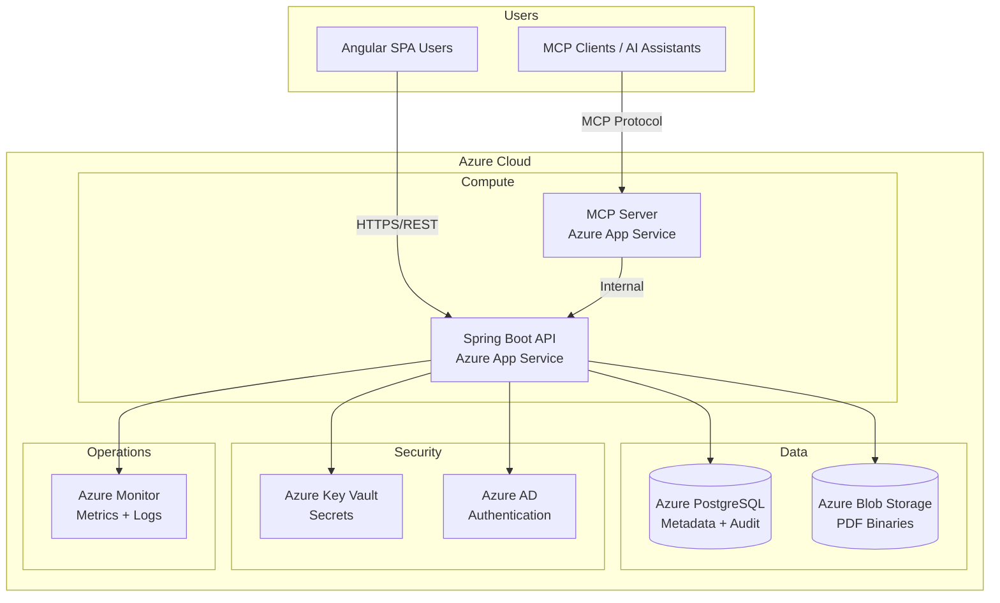
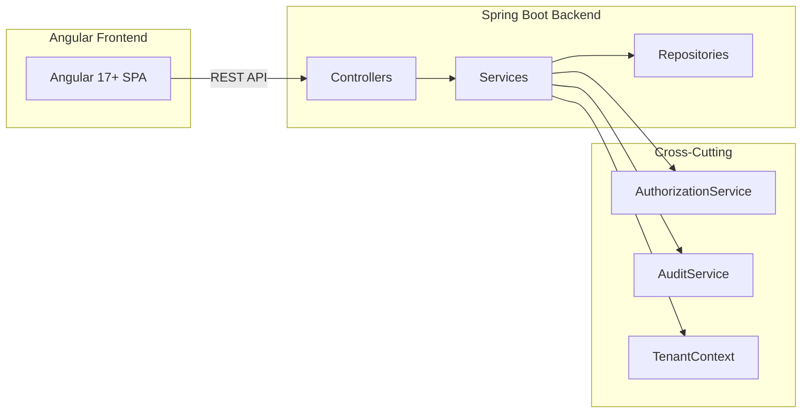
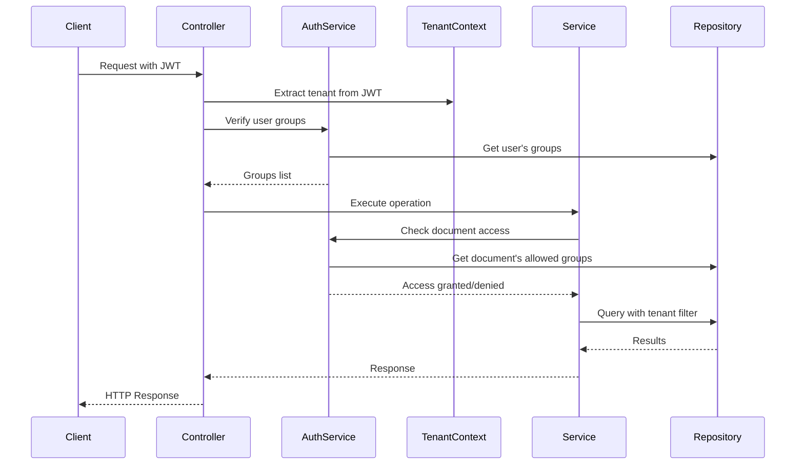

# Design Document: Cloud-Native Document Management System

## Overview

This design document describes the architecture and implementation of a Cloud-Native Document Management System (DMS) built on Microsoft Azure. The system provides comprehensive PDF document management with metadata stored as JSONB in PostgreSQL, binary storage in Azure Blob Storage, and role-based access control with multi-tenancy support.

### Key Design Decisions

1. **Stateless Backend**: Spring Boot 3.x services are stateless, enabling horizontal scaling via Azure App Service
2. **JSONB Metadata**: Flexible schema per document type with GIN indexes for performant queries
3. **Blob Naming Strategy**: Hierarchical path `{tenant_id}/{document_type}/{year}/{month}/{document_id}_v{version}.pdf` for organization and tenant isolation
4. **Immutable Versioning**: Each version stored as separate blob; previous versions never modified
5. **Append-Only Audit**: Separate table with no UPDATE/DELETE permissions for compliance
6. **MCP Integration**: Search exposed via Model Context Protocol for AI assistant integration

## Architecture

### System Context Diagram



### Component Architecture



### Layer Responsibilities

| Layer | Responsibility | Spring Annotations |
|-------|---------------|-------------------|
| Controller | HTTP handling, request validation, response mapping | `@RestController`, `@Valid` |
| Service | Business logic, transaction boundaries, authorization | `@Service`, `@Transactional`, `@PreAuthorize` |
| Repository | Data access, JPQL queries, tenant filtering | `@Repository` |
| Domain | JPA entities, no business logic | `@Entity` |
| DTO | API boundaries, request/response objects | `@Data`, `@Builder` |

## Components and Interfaces

### Backend Package Structure

```
backend/src/main/java/com/dms/
├── controller/
│   ├── DocumentController.java
│   ├── SearchController.java
│   ├── DocumentTypeController.java
│   ├── GroupController.java
│   ├── AuditController.java
│   └── AdminController.java
├── service/
│   ├── DocumentService.java
│   ├── SearchService.java
│   ├── BlobStorageService.java
│   ├── MetadataValidationService.java
│   ├── VersioningService.java
│   ├── RetentionService.java
│   ├── LegalHoldService.java
│   ├── AuditService.java
│   ├── AuthorizationService.java
│   └── GroupService.java
├── repository/
│   ├── DocumentRepository.java
│   ├── DocumentTypeRepository.java
│   ├── AuditLogRepository.java
│   ├── GroupRepository.java
│   ├── UserGroupRepository.java
│   └── LegalHoldRepository.java
├── domain/
│   ├── Document.java
│   ├── DocumentVersion.java
│   ├── DocumentType.java
│   ├── AuditLog.java
│   ├── Group.java
│   ├── UserGroup.java
│   └── LegalHold.java
├── dto/
│   ├── request/
│   │   ├── DocumentUploadRequest.java
│   │   ├── MetadataUpdateRequest.java
│   │   ├── SearchRequest.java
│   │   └── LegalHoldRequest.java
│   └── response/
│       ├── DocumentResponse.java
│       ├── SearchResultResponse.java
│       ├── VersionHistoryResponse.java
│       └── AuditLogResponse.java
├── mapper/
│   ├── DocumentMapper.java
│   ├── AuditLogMapper.java
│   └── GroupMapper.java
├── config/
│   ├── SecurityConfig.java
│   ├── BlobStorageConfig.java
│   ├── JpaConfig.java
│   └── McpConfig.java
├── exception/
│   ├── DocumentNotFoundException.java
│   ├── UnauthorizedAccessException.java
│   ├── ValidationException.java
│   ├── LegalHoldActiveException.java
│   └── GlobalExceptionHandler.java
└── mcp/
    ├── McpSearchHandler.java
    └── McpAuthorizationFilter.java
```

### Frontend Structure

```
frontend/src/app/
├── core/
│   ├── services/
│   │   ├── auth.service.ts
│   │   ├── tenant.service.ts
│   │   └── http-error.interceptor.ts
│   ├── guards/
│   │   ├── auth.guard.ts
│   │   └── role.guard.ts
│   └── interceptors/
│       └── jwt.interceptor.ts
├── shared/
│   ├── components/
│   │   ├── document-card/
│   │   ├── search-bar/
│   │   ├── pagination/
│   │   └── pdf-viewer/
│   ├── pipes/
│   │   ├── file-size.pipe.ts
│   │   └── date-format.pipe.ts
│   └── directives/
│       └── drag-drop.directive.ts
├── features/
│   ├── documents/
│   │   ├── document-list/
│   │   ├── document-upload/
│   │   ├── document-detail/
│   │   └── document-preview/
│   ├── search/
│   │   ├── search-page/
│   │   └── advanced-search/
│   ├── admin/
│   │   ├── document-types/
│   │   ├── groups/
│   │   ├── retention/
│   │   └── audit-logs/
│   └── legal/
│       └── legal-holds/
├── models/
│   ├── document.model.ts
│   ├── document-type.model.ts
│   ├── search.model.ts
│   ├── group.model.ts
│   └── audit.model.ts
└── services/
    ├── document.service.ts
    ├── search.service.ts
    ├── document-type.service.ts
    ├── group.service.ts
    └── audit.service.ts
```

### REST API Endpoints

#### Document Operations

| Method | Endpoint | Description | Authorization |
|--------|----------|-------------|---------------|
| POST | `/api/v1/documents` | Upload document | Group membership |
| GET | `/api/v1/documents/{id}` | Get document metadata | Group membership |
| GET | `/api/v1/documents/{id}/download` | Download PDF | Group membership |
| GET | `/api/v1/documents/{id}/preview` | Stream for preview | Group membership |
| PUT | `/api/v1/documents/{id}/metadata` | Update metadata | Group membership |
| POST | `/api/v1/documents/{id}/versions` | Upload new version | Group membership |
| GET | `/api/v1/documents/{id}/versions` | List version history | Group membership |
| GET | `/api/v1/documents/{id}/versions/{version}` | Get specific version | Group membership |
| DELETE | `/api/v1/documents/{id}` | Soft delete | Group membership |
| DELETE | `/api/v1/documents/{id}/hard` | Hard delete | Admin only |
| POST | `/api/v1/documents/{id}/restore` | Restore soft-deleted | Group membership |

#### Search Operations

| Method | Endpoint | Description | Authorization |
|--------|----------|-------------|---------------|
| POST | `/api/v1/search` | Search documents | Filtered by RBAC |
| POST | `/api/v1/search/bulk-download` | Bulk download as ZIP | Per-document auth |

#### Administration

| Method | Endpoint | Description | Authorization |
|--------|----------|-------------|---------------|
| GET | `/api/v1/document-types` | List document types | Authenticated |
| POST | `/api/v1/document-types` | Create document type | Admin only |
| PUT | `/api/v1/document-types/{id}` | Update document type | Admin only |
| GET | `/api/v1/groups` | List groups | Admin only |
| POST | `/api/v1/groups` | Create group | Admin only |
| PUT | `/api/v1/groups/{id}/users` | Assign users to group | Admin only |

#### Legal Hold

| Method | Endpoint | Description | Authorization |
|--------|----------|-------------|---------------|
| POST | `/api/v1/legal-holds` | Place legal hold | Legal admin |
| DELETE | `/api/v1/legal-holds/{id}` | Release legal hold | Legal admin |
| GET | `/api/v1/legal-holds` | List active holds | Legal admin |

#### Audit

| Method | Endpoint | Description | Authorization |
|--------|----------|-------------|---------------|
| GET | `/api/v1/audit/documents/{id}` | Document access history | Admin/Compliance |
| GET | `/api/v1/audit/search` | Search audit logs | Admin/Compliance |
| GET | `/api/v1/audit/export` | Export audit logs | Admin/Compliance |

### MCP Server Interface

```typescript
// MCP Tool Definitions
interface McpSearchTool {
  name: "search_documents";
  description: "Search for documents by type, metadata, or date range";
  inputSchema: {
    type: "object";
    properties: {
      documentType: { type: "string" };
      metadata: { type: "object" };
      dateFrom: { type: "string", format: "date" };
      dateTo: { type: "string", format: "date" };
      page: { type: "integer" };
      pageSize: { type: "integer" };
    };
  };
}

interface McpGetDocumentTool {
  name: "get_document";
  description: "Get document metadata by ID";
  inputSchema: {
    type: "object";
    properties: {
      documentId: { type: "string", format: "uuid" };
    };
    required: ["documentId"];
  };
}
```

## Data Models

### PostgreSQL Schema

```sql
-- Flyway migration: V001__initial_schema.sql

-- Document Types
CREATE TABLE document_types (
    id UUID PRIMARY KEY DEFAULT gen_random_uuid(),
    tenant_id UUID NOT NULL,
    name VARCHAR(100) NOT NULL,
    description TEXT,
    metadata_schema JSONB NOT NULL,
    allowed_groups UUID[] NOT NULL DEFAULT '{}',
    retention_days INTEGER NOT NULL DEFAULT 2555, -- 7 years
    min_retention_days INTEGER NOT NULL DEFAULT 0,
    created_at TIMESTAMP WITH TIME ZONE NOT NULL DEFAULT NOW(),
    created_by VARCHAR(255) NOT NULL,
    modified_at TIMESTAMP WITH TIME ZONE,
    modified_by VARCHAR(255),
    UNIQUE(tenant_id, name)
);

-- Groups
CREATE TABLE groups (
    id UUID PRIMARY KEY DEFAULT gen_random_uuid(),
    tenant_id UUID NOT NULL,
    name VARCHAR(100) NOT NULL,
    description TEXT,
    parent_group_id UUID REFERENCES groups(id),
    created_at TIMESTAMP WITH TIME ZONE NOT NULL DEFAULT NOW(),
    created_by VARCHAR(255) NOT NULL,
    UNIQUE(tenant_id, name)
);

-- User-Group assignments
CREATE TABLE user_groups (
    id UUID PRIMARY KEY DEFAULT gen_random_uuid(),
    tenant_id UUID NOT NULL,
    user_id VARCHAR(255) NOT NULL,
    group_id UUID NOT NULL REFERENCES groups(id),
    assigned_at TIMESTAMP WITH TIME ZONE NOT NULL DEFAULT NOW(),
    assigned_by VARCHAR(255) NOT NULL,
    UNIQUE(tenant_id, user_id, group_id)
);

-- Documents (metadata only)
CREATE TABLE documents (
    id UUID PRIMARY KEY DEFAULT gen_random_uuid(),
    tenant_id UUID NOT NULL,
    document_type_id UUID NOT NULL REFERENCES document_types(id),
    current_version INTEGER NOT NULL DEFAULT 1,
    metadata JSONB NOT NULL,
    blob_path VARCHAR(500) NOT NULL,
    file_size_bytes BIGINT NOT NULL,
    content_type VARCHAR(100) NOT NULL DEFAULT 'application/pdf',
    created_at TIMESTAMP WITH TIME ZONE NOT NULL DEFAULT NOW(),
    created_by VARCHAR(255) NOT NULL,
    modified_at TIMESTAMP WITH TIME ZONE,
    modified_by VARCHAR(255),
    deleted_at TIMESTAMP WITH TIME ZONE,
    deleted_by VARCHAR(255),
    retention_expires_at TIMESTAMP WITH TIME ZONE NOT NULL
);

-- Document Versions
CREATE TABLE document_versions (
    id UUID PRIMARY KEY DEFAULT gen_random_uuid(),
    tenant_id UUID NOT NULL,
    document_id UUID NOT NULL REFERENCES documents(id),
    version_number INTEGER NOT NULL,
    blob_path VARCHAR(500) NOT NULL,
    file_size_bytes BIGINT NOT NULL,
    created_at TIMESTAMP WITH TIME ZONE NOT NULL DEFAULT NOW(),
    created_by VARCHAR(255) NOT NULL,
    previous_version_id UUID REFERENCES document_versions(id),
    UNIQUE(document_id, version_number)
);

-- Legal Holds
CREATE TABLE legal_holds (
    id UUID PRIMARY KEY DEFAULT gen_random_uuid(),
    tenant_id UUID NOT NULL,
    document_id UUID NOT NULL REFERENCES documents(id),
    case_reference VARCHAR(255) NOT NULL,
    reason TEXT NOT NULL,
    placed_at TIMESTAMP WITH TIME ZONE NOT NULL DEFAULT NOW(),
    placed_by VARCHAR(255) NOT NULL,
    released_at TIMESTAMP WITH TIME ZONE,
    released_by VARCHAR(255),
    release_reason TEXT
);

-- Audit Logs (append-only, partitioned by date)
CREATE TABLE audit_logs (
    id UUID PRIMARY KEY DEFAULT gen_random_uuid(),
    tenant_id UUID NOT NULL,
    correlation_id UUID NOT NULL,
    action VARCHAR(50) NOT NULL,
    entity_type VARCHAR(50) NOT NULL,
    entity_id UUID NOT NULL,
    user_id VARCHAR(255) NOT NULL,
    client_ip INET,
    timestamp TIMESTAMP WITH TIME ZONE NOT NULL DEFAULT NOW(),
    details JSONB NOT NULL DEFAULT '{}'
) PARTITION BY RANGE (timestamp);

-- Create partitions for audit logs (example for 2024)
CREATE TABLE audit_logs_2024_q1 PARTITION OF audit_logs
    FOR VALUES FROM ('2024-01-01') TO ('2024-04-01');
CREATE TABLE audit_logs_2024_q2 PARTITION OF audit_logs
    FOR VALUES FROM ('2024-04-01') TO ('2024-07-01');
CREATE TABLE audit_logs_2024_q3 PARTITION OF audit_logs
    FOR VALUES FROM ('2024-07-01') TO ('2024-10-01');
CREATE TABLE audit_logs_2024_q4 PARTITION OF audit_logs
    FOR VALUES FROM ('2024-10-01') TO ('2025-01-01');

-- Indexes
CREATE INDEX idx_documents_tenant_id ON documents(tenant_id);
CREATE INDEX idx_documents_document_type_id ON documents(document_type_id);
CREATE INDEX idx_documents_created_at ON documents(created_at);
CREATE INDEX idx_documents_deleted_at ON documents(deleted_at) WHERE deleted_at IS NULL;
CREATE INDEX idx_documents_retention ON documents(retention_expires_at) WHERE deleted_at IS NULL;
CREATE INDEX idx_documents_metadata ON documents USING GIN (metadata jsonb_path_ops);

CREATE INDEX idx_document_versions_document_id ON document_versions(document_id);
CREATE INDEX idx_legal_holds_document_id ON legal_holds(document_id);
CREATE INDEX idx_legal_holds_active ON legal_holds(document_id) WHERE released_at IS NULL;

CREATE INDEX idx_audit_logs_tenant_id ON audit_logs(tenant_id);
CREATE INDEX idx_audit_logs_entity_id ON audit_logs(entity_id);
CREATE INDEX idx_audit_logs_user_id ON audit_logs(user_id);
CREATE INDEX idx_audit_logs_timestamp ON audit_logs(timestamp);

CREATE INDEX idx_user_groups_user_id ON user_groups(user_id);
CREATE INDEX idx_user_groups_group_id ON user_groups(group_id);

-- Revoke UPDATE/DELETE on audit_logs for application role
-- REVOKE UPDATE, DELETE ON audit_logs FROM dms_app_role;
```

### Example JSON Metadata Schemas

#### Invoice Document Type Schema

```json
{
  "$schema": "http://json-schema.org/draft-07/schema#",
  "type": "object",
  "required": ["invoiceNumber", "customerId", "invoiceDate", "totalAmount", "currency"],
  "properties": {
    "invoiceNumber": {
      "type": "string",
      "pattern": "^INV-[0-9]{4}-[0-9]{6}$"
    },
    "customerId": {
      "type": "string",
      "format": "uuid"
    },
    "customerName": {
      "type": "string",
      "maxLength": 255
    },
    "invoiceDate": {
      "type": "string",
      "format": "date"
    },
    "dueDate": {
      "type": "string",
      "format": "date"
    },
    "totalAmount": {
      "type": "number",
      "minimum": 0
    },
    "currency": {
      "type": "string",
      "enum": ["EUR", "USD", "GBP", "CHF"]
    },
    "lineItems": {
      "type": "array",
      "items": {
        "type": "object",
        "properties": {
          "description": { "type": "string" },
          "quantity": { "type": "integer", "minimum": 1 },
          "unitPrice": { "type": "number", "minimum": 0 }
        }
      }
    },
    "tags": {
      "type": "array",
      "items": { "type": "string" }
    }
  }
}
```

#### Example Document Metadata

```json
{
  "invoiceNumber": "INV-2024-000142",
  "customerId": "a1b2c3d4-e5f6-7890-abcd-ef1234567890",
  "customerName": "Acme Corporation",
  "invoiceDate": "2024-03-15",
  "dueDate": "2024-04-15",
  "totalAmount": 1250.00,
  "currency": "EUR",
  "lineItems": [
    {
      "description": "Consulting Services - March 2024",
      "quantity": 10,
      "unitPrice": 125.00
    }
  ],
  "tags": ["consulting", "q1-2024"]
}
```

### JPA Entity Examples

```java
@Entity
@Table(name = "documents")
@Data
@NoArgsConstructor
@AllArgsConstructor
@Builder
public class Document {
    @Id
    @GeneratedValue(strategy = GenerationType.UUID)
    private UUID id;
    
    @Column(name = "tenant_id", nullable = false)
    private UUID tenantId;
    
    @ManyToOne(fetch = FetchType.LAZY)
    @JoinColumn(name = "document_type_id", nullable = false)
    private DocumentType documentType;
    
    @Column(name = "current_version", nullable = false)
    private Integer currentVersion;
    
    @Type(JsonType.class)
    @Column(name = "metadata", columnDefinition = "jsonb", nullable = false)
    private Map<String, Object> metadata;
    
    @Column(name = "blob_path", nullable = false)
    private String blobPath;
    
    @Column(name = "file_size_bytes", nullable = false)
    private Long fileSizeBytes;
    
    @Column(name = "content_type", nullable = false)
    private String contentType;
    
    @Column(name = "created_at", nullable = false)
    private Instant createdAt;
    
    @Column(name = "created_by", nullable = false)
    private String createdBy;
    
    @Column(name = "modified_at")
    private Instant modifiedAt;
    
    @Column(name = "modified_by")
    private String modifiedBy;
    
    @Column(name = "deleted_at")
    private Instant deletedAt;
    
    @Column(name = "deleted_by")
    private String deletedBy;
    
    @Column(name = "retention_expires_at", nullable = false)
    private Instant retentionExpiresAt;
    
    @OneToMany(mappedBy = "document", cascade = CascadeType.ALL)
    private List<DocumentVersion> versions;
    
    @OneToMany(mappedBy = "document")
    private List<LegalHold> legalHolds;
    
    public boolean isDeleted() {
        return deletedAt != null;
    }
    
    public boolean hasActiveLegalHold() {
        return legalHolds != null && 
               legalHolds.stream().anyMatch(h -> h.getReleasedAt() == null);
    }
}
```

### DTO Examples

```java
@Data
@Builder
public class DocumentUploadRequest {
    @NotNull
    private UUID documentTypeId;
    
    @NotNull
    @Valid
    private Map<String, Object> metadata;
    
    private String idempotencyKey;
}

@Data
@Builder
public class DocumentResponse {
    private UUID id;
    private String documentTypeName;
    private Integer currentVersion;
    private Map<String, Object> metadata;
    private Long fileSizeBytes;
    private Instant createdAt;
    private String createdBy;
    private Instant modifiedAt;
    private String modifiedBy;
    private boolean hasActiveLegalHold;
    private Instant retentionExpiresAt;
}

@Data
@Builder
public class SearchRequest {
    private UUID documentTypeId;
    private Map<String, Object> metadataFilters;
    private LocalDate dateFrom;
    private LocalDate dateTo;
    
    @Min(0)
    private Integer page = 0;
    
    @Min(1)
    @Max(100)
    private Integer pageSize = 20;
    
    private boolean includeDeleted = false;
}

@Data
@Builder
public class SearchResultResponse {
    private List<DocumentResponse> documents;
    private long totalCount;
    private int page;
    private int pageSize;
    private int totalPages;
}
```

### Blob Storage Naming Strategy

```
{storage_account}/
└── documents/
    └── {tenant_id}/
        └── {document_type}/
            └── {year}/
                └── {month}/
                    └── {document_id}_v{version}.pdf

Example:
dmsstorage/documents/tenant-abc123/invoice/2024/03/doc-xyz789_v1.pdf
dmsstorage/documents/tenant-abc123/invoice/2024/03/doc-xyz789_v2.pdf
```

### Authorization Flow




## Correctness Properties

*A property is a characteristic or behavior that should hold true across all valid executions of a system—essentially, a formal statement about what the system should do. Properties serve as the bridge between human-readable specifications and machine-verifiable correctness guarantees.*

### Property 1: Upload Atomicity

*For any* document upload operation, if the operation succeeds, both the blob in Azure Blob Storage and the metadata record in PostgreSQL must exist; if the operation fails, neither the blob nor the metadata record should exist.

**Validates: Requirements 1.1, 1.11**

### Property 2: System-Assigned Fields Population

*For any* successfully uploaded document, the fields `documentType`, `createdBy`, `createdAt`, `tenant_id`, and `allowedGroups` must be non-null and contain valid values derived from the request context and document type configuration.

**Validates: Requirements 1.2**

### Property 3: Metadata Schema Validation

*For any* document upload or metadata update operation, if the provided metadata conforms to the document type's JSON schema, the operation should succeed; if the metadata does not conform, the operation should be rejected with validation errors.

**Validates: Requirements 1.3, 1.4, 4.1, 14.2, 14.4**

### Property 4: PDF Format Validation

*For any* file upload, if the file's magic bytes match the PDF signature (`%PDF-`), the format validation should pass; if the magic bytes do not match, the upload should be rejected.

**Validates: Requirements 1.9**

### Property 5: Idempotent Upload

*For any* upload request with an idempotency key, submitting the same request multiple times should return the same document ID and not create duplicate documents.

**Validates: Requirements 1.10**

### Property 6: Search Result Tenant and Type Filtering

*For any* search query specifying a document type, all returned documents must match that document type AND belong to the requesting user's tenant.

**Validates: Requirements 2.1, 20.2**

### Property 7: RBAC Search Filtering

*For any* search query, all returned documents must have at least one allowed group that the requesting user is a member of.

**Validates: Requirements 2.4, 15.4**

### Property 8: Soft-Deleted Document Exclusion

*For any* default search query (where `includeDeleted` is false), no returned documents should have a non-null `deleted_at` timestamp.

**Validates: Requirements 2.7**

### Property 9: Pagination Metadata Consistency

*For any* search response, the `totalPages` value must equal `ceil(totalCount / pageSize)`, and the `page` value must be within the range `[0, totalPages - 1]` when results exist.

**Validates: Requirements 2.11**

### Property 10: Authorization Enforcement

*For any* document access request (view, download, preview), if the user is not a member of any group in the document's allowed groups OR the document belongs to a different tenant, the system should return HTTP 403 Forbidden.

**Validates: Requirements 3.1, 3.2, 15.3, 20.4**

### Property 11: Audit Log Metadata Diff

*For any* metadata update operation, the audit log entry must contain both the before and after values as a JSON diff, and the diff must accurately reflect the changes made.

**Validates: Requirements 4.3**

### Property 12: Version Number Sequential Increment

*For any* new version upload, the new version number must equal the previous current version number plus one, and this increment must be atomic (no gaps or duplicates).

**Validates: Requirements 5.1**

### Property 13: Version Immutability

*For any* document with multiple versions, uploading a new version or restoring a previous version must not modify the blob content or metadata of any existing version.

**Validates: Requirements 5.2**

### Property 14: Version Restore Creates New Version

*For any* version restore operation, the result must be a new version with an incremented version number containing the content of the specified previous version, not an in-place modification of the current version.

**Validates: Requirements 5.4**

### Property 15: Soft Delete Preserves Data

*For any* soft delete operation, the document's blob and metadata must remain intact, and only the `deleted_at` and `deleted_by` fields should be set.

**Validates: Requirements 6.1**

### Property 16: Legal Hold Blocks All Deletion

*For any* document with at least one active legal hold (where `released_at` is null), all deletion operations (soft delete, hard delete, and retention-based automatic deletion) must be rejected.

**Validates: Requirements 6.6, 7.2, 8.3, 10.1, 10.8**

### Property 17: Retention Rule Enforcement

*For any* hard delete request, if the document's age (current time minus `created_at`) is less than the document type's retention period, the deletion must be rejected.

**Validates: Requirements 7.1**

### Property 18: Multiple Concurrent Legal Holds

*For any* document, it must be possible to have multiple active legal holds with different case references simultaneously, and each hold must be independently releasable.

**Validates: Requirements 10.7**

### Property 19: Schema Evolution Non-Breaking

*For any* document type schema update, all documents that were valid under the previous schema must remain retrievable and not cause validation errors on read operations.

**Validates: Requirements 14.6**

### Property 20: Tenant Isolation

*For any* database query executed by the application, the query must include a filter on `tenant_id` matching the current user's tenant, ensuring no cross-tenant data leakage.

**Validates: Requirements 20.2, 20.4**

### Property 21: Rate Limiting Enforcement

*For any* user or tenant exceeding the configured rate limit (default 100 requests/minute), subsequent requests within the rate limit window must receive HTTP 429 Too Many Requests.

**Validates: Requirements 23.5**

## Error Handling

### Exception Hierarchy

```java
// Base exception for all DMS errors
public abstract class DmsException extends RuntimeException {
    private final String errorCode;
    private final HttpStatus httpStatus;
}

// Specific exceptions
public class DocumentNotFoundException extends DmsException {
    // HTTP 404, errorCode: "DOCUMENT_NOT_FOUND"
}

public class UnauthorizedAccessException extends DmsException {
    // HTTP 403, errorCode: "ACCESS_DENIED"
}

public class ValidationException extends DmsException {
    private final List<FieldError> fieldErrors;
    // HTTP 400, errorCode: "VALIDATION_FAILED"
}

public class LegalHoldActiveException extends DmsException {
    private final List<UUID> activeHoldIds;
    // HTTP 409, errorCode: "LEGAL_HOLD_ACTIVE"
}

public class RetentionNotExpiredException extends DmsException {
    private final Instant retentionExpiresAt;
    // HTTP 409, errorCode: "RETENTION_NOT_EXPIRED"
}

public class RateLimitExceededException extends DmsException {
    private final Instant retryAfter;
    // HTTP 429, errorCode: "RATE_LIMIT_EXCEEDED"
}

public class BlobStorageException extends DmsException {
    // HTTP 503, errorCode: "STORAGE_UNAVAILABLE"
}

public class TenantMismatchException extends DmsException {
    // HTTP 403, errorCode: "TENANT_MISMATCH"
}
```

### Global Exception Handler

```java
@RestControllerAdvice
@Slf4j
public class GlobalExceptionHandler {

    @ExceptionHandler(DocumentNotFoundException.class)
    public ResponseEntity<ErrorResponse> handleNotFound(DocumentNotFoundException ex) {
        log.warn("Document not found: {}", ex.getMessage());
        return ResponseEntity.status(HttpStatus.NOT_FOUND)
            .body(ErrorResponse.builder()
                .errorCode(ex.getErrorCode())
                .message("Document not found")
                .timestamp(Instant.now())
                .build());
    }

    @ExceptionHandler(UnauthorizedAccessException.class)
    public ResponseEntity<ErrorResponse> handleUnauthorized(UnauthorizedAccessException ex) {
        log.warn("Unauthorized access attempt: {}", ex.getMessage());
        // Don't reveal whether document exists
        return ResponseEntity.status(HttpStatus.FORBIDDEN)
            .body(ErrorResponse.builder()
                .errorCode(ex.getErrorCode())
                .message("Access denied")
                .timestamp(Instant.now())
                .build());
    }

    @ExceptionHandler(ValidationException.class)
    public ResponseEntity<ErrorResponse> handleValidation(ValidationException ex) {
        return ResponseEntity.status(HttpStatus.BAD_REQUEST)
            .body(ErrorResponse.builder()
                .errorCode(ex.getErrorCode())
                .message("Validation failed")
                .fieldErrors(ex.getFieldErrors())
                .timestamp(Instant.now())
                .build());
    }

    @ExceptionHandler(LegalHoldActiveException.class)
    public ResponseEntity<ErrorResponse> handleLegalHold(LegalHoldActiveException ex) {
        return ResponseEntity.status(HttpStatus.CONFLICT)
            .body(ErrorResponse.builder()
                .errorCode(ex.getErrorCode())
                .message("Document has active legal hold(s)")
                .details(Map.of("activeHoldIds", ex.getActiveHoldIds()))
                .timestamp(Instant.now())
                .build());
    }

    @ExceptionHandler(RateLimitExceededException.class)
    public ResponseEntity<ErrorResponse> handleRateLimit(RateLimitExceededException ex) {
        return ResponseEntity.status(HttpStatus.TOO_MANY_REQUESTS)
            .header("Retry-After", String.valueOf(ex.getRetryAfter().getEpochSecond()))
            .body(ErrorResponse.builder()
                .errorCode(ex.getErrorCode())
                .message("Rate limit exceeded")
                .timestamp(Instant.now())
                .build());
    }
}
```

### Error Response Format

```json
{
  "errorCode": "VALIDATION_FAILED",
  "message": "Validation failed",
  "timestamp": "2024-03-15T10:30:00Z",
  "correlationId": "abc123-def456",
  "fieldErrors": [
    {
      "field": "metadata.invoiceNumber",
      "message": "must match pattern ^INV-[0-9]{4}-[0-9]{6}$",
      "rejectedValue": "INV-123"
    }
  ]
}
```

### Circuit Breaker for Blob Storage

```java
@Service
@RequiredArgsConstructor
public class BlobStorageService {
    
    private final BlobServiceClient blobServiceClient;
    private final CircuitBreaker circuitBreaker;
    
    public byte[] downloadBlob(String blobPath) {
        return circuitBreaker.run(
            () -> doDownload(blobPath),
            throwable -> {
                log.error("Blob storage unavailable, circuit open", throwable);
                throw new BlobStorageException("Storage temporarily unavailable");
            }
        );
    }
}
```

## Testing Strategy

### Testing Framework Selection

| Layer | Framework | Purpose |
|-------|-----------|---------|
| Backend Unit | JUnit 5 + Mockito | Service logic, mappers |
| Backend Integration | @WebMvcTest, @DataJpaTest | Controllers, repositories |
| Backend Property | jqwik | Property-based testing |
| Frontend Unit | Vitest | Services, utilities, mappers |
| E2E | Playwright | Full user flows |

### Property-Based Testing Configuration

Property tests use **jqwik** for Java with minimum 100 iterations per property:

```java
@Property(tries = 100)
// Feature: cloud-document-management-system, Property 3: Metadata Schema Validation
void shouldValidateMetadataAgainstSchema(
    @ForAll("validInvoiceMetadata") Map<String, Object> metadata
) {
    // Arrange
    var schema = loadInvoiceSchema();
    
    // Act
    var result = validationService.validate(metadata, schema);
    
    // Assert
    assertThat(result.isValid()).isTrue();
}

@Property(tries = 100)
// Feature: cloud-document-management-system, Property 3: Metadata Schema Validation
void shouldRejectInvalidMetadata(
    @ForAll("invalidInvoiceMetadata") Map<String, Object> metadata
) {
    // Arrange
    var schema = loadInvoiceSchema();
    
    // Act
    var result = validationService.validate(metadata, schema);
    
    // Assert
    assertThat(result.isValid()).isFalse();
    assertThat(result.getErrors()).isNotEmpty();
}
```

### Unit Test Examples

```java
@ExtendWith(MockitoExtension.class)
class DocumentServiceTest {

    @Mock
    private DocumentRepository documentRepository;
    
    @Mock
    private BlobStorageService blobStorageService;
    
    @Mock
    private AuthorizationService authorizationService;
    
    @Mock
    private AuditService auditService;
    
    @Mock
    private Clock clock;
    
    @InjectMocks
    private DocumentService documentService;

    @Test
    void shouldUploadDocument_whenMetadataIsValid() {
        // Arrange
        var request = createValidUploadRequest();
        var tenantId = UUID.randomUUID();
        when(clock.instant()).thenReturn(Instant.parse("2024-03-15T10:00:00Z"));
        when(authorizationService.canUpload(any(), any())).thenReturn(true);
        when(blobStorageService.uploadBlob(any(), any())).thenReturn("blob/path");
        when(documentRepository.save(any())).thenAnswer(i -> i.getArgument(0));
        
        // Act
        var result = documentService.uploadDocument(request, tenantId, "user123");
        
        // Assert
        assertThat(result.getId()).isNotNull();
        assertThat(result.getCreatedAt()).isEqualTo(Instant.parse("2024-03-15T10:00:00Z"));
        verify(auditService).logUpload(any());
    }

    @Test
    void shouldRejectUpload_whenUserNotAuthorized() {
        // Arrange
        var request = createValidUploadRequest();
        when(authorizationService.canUpload(any(), any())).thenReturn(false);
        
        // Act & Assert
        assertThatThrownBy(() -> documentService.uploadDocument(request, UUID.randomUUID(), "user123"))
            .isInstanceOf(UnauthorizedAccessException.class);
        verify(blobStorageService, never()).uploadBlob(any(), any());
    }

    @Test
    void shouldBlockDeletion_whenLegalHoldActive() {
        // Arrange
        var documentId = UUID.randomUUID();
        var document = createDocumentWithLegalHold();
        when(documentRepository.findByIdAndTenantId(documentId, any())).thenReturn(Optional.of(document));
        
        // Act & Assert
        assertThatThrownBy(() -> documentService.softDelete(documentId, UUID.randomUUID(), "user123"))
            .isInstanceOf(LegalHoldActiveException.class);
    }
}
```

### Integration Test Examples

```java
@WebMvcTest(DocumentController.class)
@Import(SecurityConfig.class)
class DocumentControllerIntegrationTest {

    @Autowired
    private MockMvc mockMvc;
    
    @MockBean
    private DocumentService documentService;

    @Test
    @WithMockUser(roles = "USER")
    void shouldReturn200_whenDocumentFound() throws Exception {
        // Arrange
        var documentId = UUID.randomUUID();
        var response = createDocumentResponse();
        when(documentService.getDocument(documentId, any())).thenReturn(response);
        
        // Act & Assert
        mockMvc.perform(get("/api/v1/documents/{id}", documentId))
            .andExpect(status().isOk())
            .andExpect(jsonPath("$.id").value(documentId.toString()));
    }

    @Test
    @WithMockUser(roles = "USER")
    void shouldReturn403_whenNotAuthorized() throws Exception {
        // Arrange
        var documentId = UUID.randomUUID();
        when(documentService.getDocument(documentId, any()))
            .thenThrow(new UnauthorizedAccessException("Access denied"));
        
        // Act & Assert
        mockMvc.perform(get("/api/v1/documents/{id}", documentId))
            .andExpect(status().isForbidden());
    }
}

@DataJpaTest
@AutoConfigureTestDatabase(replace = AutoConfigureTestDatabase.Replace.NONE)
@Testcontainers
class DocumentRepositoryIntegrationTest {

    @Container
    static PostgreSQLContainer<?> postgres = new PostgreSQLContainer<>("postgres:15");

    @Autowired
    private DocumentRepository documentRepository;

    @Test
    void shouldFilterByTenantId() {
        // Arrange
        var tenant1 = UUID.randomUUID();
        var tenant2 = UUID.randomUUID();
        createDocument(tenant1);
        createDocument(tenant2);
        
        // Act
        var results = documentRepository.findAllByTenantId(tenant1);
        
        // Assert
        assertThat(results).allMatch(d -> d.getTenantId().equals(tenant1));
    }

    @Test
    void shouldQueryJsonbMetadata() {
        // Arrange
        var tenantId = UUID.randomUUID();
        createDocumentWithMetadata(tenantId, Map.of("invoiceNumber", "INV-2024-000001"));
        createDocumentWithMetadata(tenantId, Map.of("invoiceNumber", "INV-2024-000002"));
        
        // Act
        var results = documentRepository.findByMetadataField(
            tenantId, "invoiceNumber", "INV-2024-000001"
        );
        
        // Assert
        assertThat(results).hasSize(1);
    }
}
```

### Frontend Test Examples (Vitest)

```typescript
// document.service.spec.ts
describe('DocumentService', () => {
  let service: DocumentService;
  let httpMock: HttpTestingController;

  beforeEach(() => {
    TestBed.configureTestingModule({
      imports: [HttpClientTestingModule],
      providers: [DocumentService]
    });
    service = TestBed.inject(DocumentService);
    httpMock = TestBed.inject(HttpTestingController);
  });

  it('should transform search response correctly', () => {
    // Arrange
    const apiResponse = {
      documents: [{ id: '123', metadata: { invoiceNumber: 'INV-001' } }],
      totalCount: 1,
      page: 0,
      pageSize: 20
    };

    // Act
    service.search({ documentTypeId: 'invoice' }).subscribe(result => {
      // Assert
      expect(result.documents).toHaveLength(1);
      expect(result.totalPages).toBe(1);
    });

    httpMock.expectOne('/api/v1/search').flush(apiResponse);
  });
});

// metadata-validator.spec.ts
describe('MetadataValidator', () => {
  it('should validate invoice number format', () => {
    const validator = new MetadataValidator(invoiceSchema);
    
    expect(validator.validate({ invoiceNumber: 'INV-2024-000001' }).valid).toBe(true);
    expect(validator.validate({ invoiceNumber: 'invalid' }).valid).toBe(false);
  });

  it('should return field-level errors', () => {
    const validator = new MetadataValidator(invoiceSchema);
    const result = validator.validate({ invoiceNumber: 'bad', totalAmount: -100 });
    
    expect(result.errors).toContainEqual(
      expect.objectContaining({ field: 'invoiceNumber' })
    );
    expect(result.errors).toContainEqual(
      expect.objectContaining({ field: 'totalAmount' })
    );
  });
});

// file-size.pipe.spec.ts
describe('FileSizePipe', () => {
  const pipe = new FileSizePipe();

  it('should format bytes correctly', () => {
    expect(pipe.transform(0)).toBe('0 B');
    expect(pipe.transform(1024)).toBe('1 KB');
    expect(pipe.transform(1048576)).toBe('1 MB');
    expect(pipe.transform(1073741824)).toBe('1 GB');
  });

  it('should handle null/undefined', () => {
    expect(pipe.transform(null)).toBe('0 B');
    expect(pipe.transform(undefined)).toBe('0 B');
  });
});
```

### Coverage Targets

| Component | Line Coverage | Branch Coverage |
|-----------|--------------|-----------------|
| Services | 80% | 75% |
| Repositories | 70% | 60% |
| Controllers | 70% | 60% |
| Mappers | 90% | 80% |
| Frontend Services | 80% | 75% |
| Frontend Utilities | 90% | 85% |

### Test Data Generators (jqwik)

```java
public class DocumentArbitraries {

    @Provide
    Arbitrary<Map<String, Object>> validInvoiceMetadata() {
        return Combinators.combine(
            Arbitraries.strings().withCharRange('0', '9').ofLength(6)
                .map(n -> "INV-2024-" + n),
            Arbitraries.create(UUID::randomUUID),
            Arbitraries.doubles().between(0.01, 1000000.00),
            Arbitraries.of("EUR", "USD", "GBP", "CHF")
        ).as((invoiceNumber, customerId, amount, currency) -> Map.of(
            "invoiceNumber", invoiceNumber,
            "customerId", customerId.toString(),
            "totalAmount", amount,
            "currency", currency,
            "invoiceDate", LocalDate.now().toString()
        ));
    }

    @Provide
    Arbitrary<Map<String, Object>> invalidInvoiceMetadata() {
        return Arbitraries.oneOf(
            // Missing required field
            Arbitraries.just(Map.of("customerId", UUID.randomUUID().toString())),
            // Invalid invoice number format
            Arbitraries.just(Map.of(
                "invoiceNumber", "INVALID",
                "customerId", UUID.randomUUID().toString(),
                "totalAmount", 100.0,
                "currency", "EUR",
                "invoiceDate", LocalDate.now().toString()
            )),
            // Negative amount
            Arbitraries.just(Map.of(
                "invoiceNumber", "INV-2024-000001",
                "customerId", UUID.randomUUID().toString(),
                "totalAmount", -100.0,
                "currency", "EUR",
                "invoiceDate", LocalDate.now().toString()
            ))
        );
    }

    @Provide
    Arbitrary<byte[]> validPdfBytes() {
        return Arbitraries.bytes().array(byte[].class)
            .ofMinSize(100).ofMaxSize(10000)
            .map(bytes -> {
                // Prepend PDF magic bytes
                byte[] pdf = new byte[bytes.length + 5];
                pdf[0] = '%';
                pdf[1] = 'P';
                pdf[2] = 'D';
                pdf[3] = 'F';
                pdf[4] = '-';
                System.arraycopy(bytes, 0, pdf, 5, bytes.length);
                return pdf;
            });
    }

    @Provide
    Arbitrary<byte[]> invalidPdfBytes() {
        return Arbitraries.bytes().array(byte[].class)
            .ofMinSize(10).ofMaxSize(1000)
            .filter(bytes -> bytes.length < 5 || 
                bytes[0] != '%' || bytes[1] != 'P' || 
                bytes[2] != 'D' || bytes[3] != 'F');
    }
}
```
