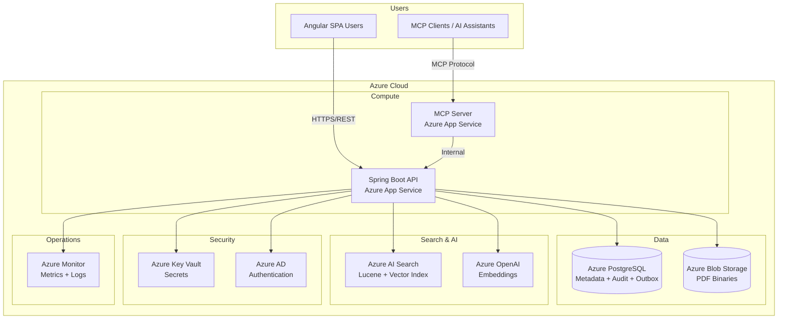
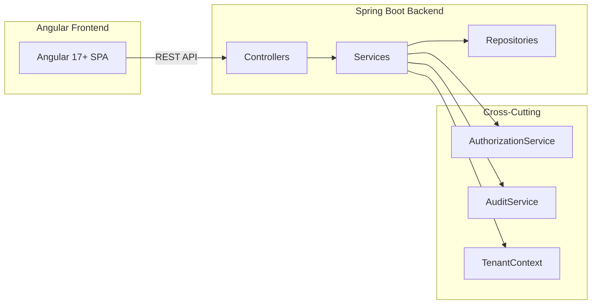
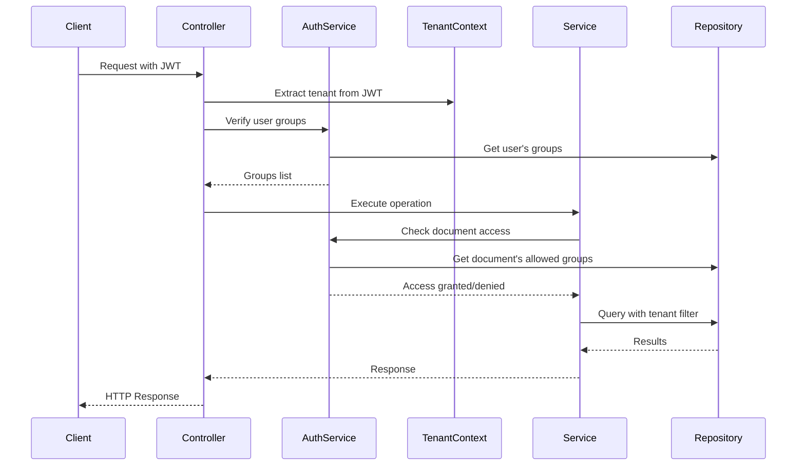
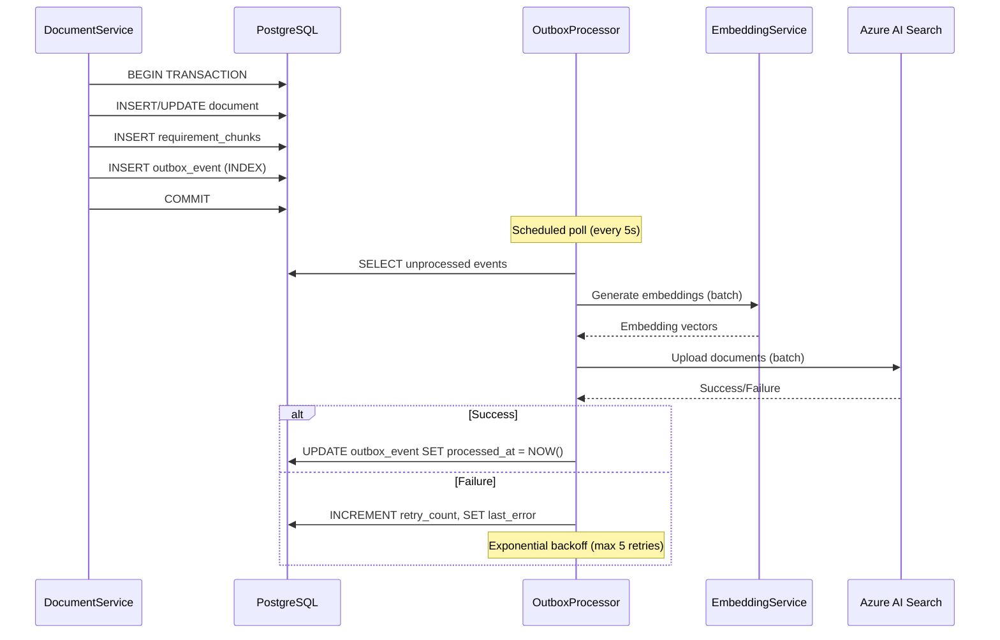

# Design Document: Cloud-Native Document Management System

## Overview

This design document describes the architecture and implementation of a Cloud-Native Document Management System (DMS) built on Microsoft Azure. The system provides comprehensive PDF document management with metadata stored as JSONB in PostgreSQL, binary storage in Azure Blob Storage, and role-based access control with multi-tenancy support.

### Key Design Decisions

1. **Stateless Backend**: Spring Boot 3.x services are stateless, enabling horizontal scaling via Azure App Service
2. **JSONB Metadata**: Flexible schema per document type with GIN indexes for performant queries
3. **Blob Naming Strategy**: Hierarchical path `{tenant_id}/{document_type}/{year}/{month}/{document_id}_v{version}.pdf` for organization and tenant isolation
4. **Immutable Versioning**: Each version stored as separate blob; previous versions never modified
5. **Append-Only Audit**: Separate table with no UPDATE/DELETE permissions for compliance
6. **MCP Integration**: Search exposed via Model Context Protocol for AI assistant integration
7. **Hybrid Search via Azure AI Search**: Keyword (Lucene) + vector (HNSW) search with outbox-based synchronization from PostgreSQL; eventual consistency with PG fallback
8. **Outbox Pattern for Index Sync**: Transactional outbox in PostgreSQL guarantees at-least-once delivery of index mutations to Azure AI Search

## Architecture

### System Context Diagram



### Component Architecture



### Layer Responsibilities

| Layer | Responsibility | Spring Annotations |
|-------|---------------|-------------------|
| Controller | HTTP handling, request validation, response mapping | `@RestController`, `@Valid` |
| Service | Business logic, transaction boundaries, authorization | `@Service`, `@Transactional`, `@PreAuthorize` |
| Repository | Data access, JPQL queries, tenant filtering | `@Repository` |
| Domain | JPA entities, no business logic | `@Entity` |
| DTO | API boundaries, request/response objects | `@Data`, `@Builder` |

## Components and Interfaces

### Backend Package Structure

```
backend/src/main/java/com/dms/
├── controller/
│   ├── DocumentController.java
│   ├── SearchController.java
│   ├── DocumentTypeController.java
│   ├── GroupController.java
│   ├── AuditController.java
│   └── AdminController.java
├── service/
│   ├── DocumentService.java
│   ├── SearchService.java
│   ├── BlobStorageService.java
│   ├── MetadataValidationService.java
│   ├── VersioningService.java
│   ├── RetentionService.java
│   ├── LegalHoldService.java
│   ├── AuditService.java
│   ├── AuthorizationService.java
│   └── GroupService.java
├── repository/
│   ├── DocumentRepository.java
│   ├── DocumentTypeRepository.java
│   ├── AuditLogRepository.java
│   ├── GroupRepository.java
│   ├── UserGroupRepository.java
│   └── LegalHoldRepository.java
├── domain/
│   ├── Document.java
│   ├── DocumentVersion.java
│   ├── DocumentType.java
│   ├── AuditLog.java
│   ├── Group.java
│   ├── UserGroup.java
│   └── LegalHold.java
├── dto/
│   ├── request/
│   │   ├── DocumentUploadRequest.java
│   │   ├── MetadataUpdateRequest.java
│   │   ├── SearchRequest.java
│   │   └── LegalHoldRequest.java
│   └── response/
│       ├── DocumentResponse.java
│       ├── SearchResultResponse.java
│       ├── VersionHistoryResponse.java
│       └── AuditLogResponse.java
├── mapper/
│   ├── DocumentMapper.java
│   ├── AuditLogMapper.java
│   └── GroupMapper.java
├── config/
│   ├── SecurityConfig.java
│   ├── BlobStorageConfig.java
│   ├── JpaConfig.java
│   └── McpConfig.java
├── exception/
│   ├── DocumentNotFoundException.java
│   ├── UnauthorizedAccessException.java
│   ├── ValidationException.java
│   ├── LegalHoldActiveException.java
│   └── GlobalExceptionHandler.java
└── mcp/
    ├── McpSearchHandler.java
    └── McpAuthorizationFilter.java
```

### Frontend Structure

```
frontend/src/app/
├── core/
│   ├── services/
│   │   ├── auth.service.ts
│   │   ├── tenant.service.ts
│   │   └── http-error.interceptor.ts
│   ├── guards/
│   │   ├── auth.guard.ts
│   │   └── role.guard.ts
│   └── interceptors/
│       └── jwt.interceptor.ts
├── shared/
│   ├── components/
│   │   ├── document-card/
│   │   ├── search-bar/
│   │   ├── pagination/
│   │   └── pdf-viewer/
│   ├── pipes/
│   │   ├── file-size.pipe.ts
│   │   └── date-format.pipe.ts
│   └── directives/
│       └── drag-drop.directive.ts
├── features/
│   ├── documents/
│   │   ├── document-list/
│   │   ├── document-upload/
│   │   ├── document-detail/
│   │   └── document-preview/
│   ├── search/
│   │   ├── search-page/
│   │   └── advanced-search/
│   ├── admin/
│   │   ├── document-types/
│   │   ├── groups/
│   │   ├── retention/
│   │   └── audit-logs/
│   └── legal/
│       └── legal-holds/
├── models/
│   ├── document.model.ts
│   ├── document-type.model.ts
│   ├── search.model.ts
│   ├── group.model.ts
│   └── audit.model.ts
└── services/
    ├── document.service.ts
    ├── search.service.ts
    ├── document-type.service.ts
    ├── group.service.ts
    └── audit.service.ts
```

### REST API Endpoints

#### Document Operations

| Method | Endpoint | Description | Authorization |
|--------|----------|-------------|---------------|
| POST | `/api/v1/documents` | Upload document | Group membership |
| GET | `/api/v1/documents/{id}` | Get document metadata | Group membership |
| GET | `/api/v1/documents/{id}/download` | Download PDF | Group membership |
| GET | `/api/v1/documents/{id}/preview` | Stream for preview | Group membership |
| PUT | `/api/v1/documents/{id}/metadata` | Update metadata | Group membership |
| POST | `/api/v1/documents/{id}/versions` | Upload new version | Group membership |
| GET | `/api/v1/documents/{id}/versions` | List version history | Group membership |
| GET | `/api/v1/documents/{id}/versions/{version}` | Get specific version | Group membership |
| DELETE | `/api/v1/documents/{id}` | Soft delete | Group membership |
| DELETE | `/api/v1/documents/{id}/hard` | Hard delete | Admin only |
| POST | `/api/v1/documents/{id}/restore` | Restore soft-deleted | Group membership |

#### Search Operations

| Method | Endpoint | Description | Authorization |
|--------|----------|-------------|---------------|
| POST | `/api/v1/search` | Search documents | Filtered by RBAC |
| POST | `/api/v1/search/bulk-download` | Bulk download as ZIP | Per-document auth |

#### Administration

| Method | Endpoint | Description | Authorization |
|--------|----------|-------------|---------------|
| GET | `/api/v1/document-types` | List document types | Authenticated |
| POST | `/api/v1/document-types` | Create document type | Admin only |
| PUT | `/api/v1/document-types/{id}` | Update document type | Admin only |
| GET | `/api/v1/groups` | List groups | Admin only |
| POST | `/api/v1/groups` | Create group | Admin only |
| PUT | `/api/v1/groups/{id}/users` | Assign users to group | Admin only |

#### Legal Hold

| Method | Endpoint | Description | Authorization |
|--------|----------|-------------|---------------|
| POST | `/api/v1/legal-holds` | Place legal hold | Legal admin |
| DELETE | `/api/v1/legal-holds/{id}` | Release legal hold | Legal admin |
| GET | `/api/v1/legal-holds` | List active holds | Legal admin |

#### Audit

| Method | Endpoint | Description | Authorization |
|--------|----------|-------------|---------------|
| GET | `/api/v1/audit/documents/{id}` | Document access history | Admin/Compliance |
| GET | `/api/v1/audit/search` | Search audit logs | Admin/Compliance |
| GET | `/api/v1/audit/export` | Export audit logs | Admin/Compliance |

### MCP Server Service Definition

The DMS exposes an MCP tool server implementing the Model Context Protocol specification. The server runs as a separate Azure App Service instance that delegates to the Spring Boot API for data access, authorization, and audit logging. All MCP requests are authenticated via Azure AD tokens with identical RBAC enforcement as the REST API.

#### Deployment and Authentication

```
┌──────────────────┐     ┌──────────────────┐     ┌──────────────┐
│  MCP Client      │────▶│  MCP Server      │────▶│  Spring Boot │
│  (AI Assistant /  │ MCP │  (Azure App Svc) │ REST│  API         │
│   IDE Agent)     │     │                  │     │              │
└──────────────────┘     └──────────────────┘     └──────────────┘
                              │
                              ▼
                         ┌──────────────────┐
                         │  Azure AD        │
                         │  Token Validation│
                         └──────────────────┘
```

- MCP clients authenticate using Azure AD bearer tokens (same identity provider as REST API)
- The MCP server validates tokens, extracts `tenant_id` and user claims, then forwards authorized requests to the API
- Request signing (HMAC-SHA256) is enforced between MCP server and API for internal calls (Requirement 23.10)
- All MCP tool invocations are logged in the retrieval audit log

#### Server Metadata

```json
{
  "name": "dms-mcp-server",
  "version": "1.0.0",
  "description": "Cloud-Native Document Management System - MCP Tool Server for AI agent integration",
  "protocolVersion": "2024-11-05"
}
```

#### Tool Definitions

##### 1. search_documents

Search for documents by type, metadata, or date range. Results are filtered by tenant and RBAC.

```json
{
  "name": "search_documents",
  "description": "Search for documents by type, metadata fields, or date range. Returns paginated results filtered by the caller's tenant and group permissions.",
  "inputSchema": {
    "type": "object",
    "properties": {
      "documentType": {
        "type": "string",
        "description": "Document type name to filter by (e.g., 'invoice', 'dunning_letter')"
      },
      "metadata": {
        "type": "object",
        "description": "Key-value pairs to match against document JSONB metadata"
      },
      "dateFrom": {
        "type": "string",
        "format": "date",
        "description": "Start of date range filter (inclusive, ISO 8601)"
      },
      "dateTo": {
        "type": "string",
        "format": "date",
        "description": "End of date range filter (inclusive, ISO 8601)"
      },
      "includeDeleted": {
        "type": "boolean",
        "default": false,
        "description": "Whether to include soft-deleted documents"
      },
      "page": {
        "type": "integer",
        "default": 0,
        "minimum": 0,
        "description": "Zero-based page number"
      },
      "pageSize": {
        "type": "integer",
        "default": 20,
        "minimum": 1,
        "maximum": 100,
        "description": "Number of results per page"
      }
    }
  }
}
```

**Validates: Requirements 2.1–2.11, 15.6**

##### 2. get_document

Retrieve document metadata by ID.

```json
{
  "name": "get_document",
  "description": "Get document metadata by ID. Returns full metadata, version info, and legal hold status. Requires group membership for the document's type.",
  "inputSchema": {
    "type": "object",
    "properties": {
      "documentId": {
        "type": "string",
        "format": "uuid",
        "description": "The document UUID"
      }
    },
    "required": ["documentId"]
  }
}
```

**Validates: Requirements 3.1, 3.2**

##### 3. search_requirements

Hybrid keyword + semantic search over requirement chunks. Uses Azure AI Search with weighted scoring, recency boost, and approval-status boost.

```json
{
  "name": "search_requirements",
  "description": "Search requirements using hybrid keyword and semantic search. Returns ranked requirement chunks with relevance scores. Defaults to approved requirements only.",
  "inputSchema": {
    "type": "object",
    "properties": {
      "query": {
        "type": "string",
        "description": "Semantic search query text"
      },
      "module": {
        "type": "string",
        "description": "Filter by module name"
      },
      "documentType": {
        "type": "string",
        "description": "Filter by document type"
      },
      "approvalStatus": {
        "type": "string",
        "enum": ["approved", "draft", "all"],
        "default": "approved",
        "description": "Filter by approval status"
      },
      "dateFrom": {
        "type": "string",
        "format": "date",
        "description": "Filter by creation/modification date (start)"
      },
      "dateTo": {
        "type": "string",
        "format": "date",
        "description": "Filter by creation/modification date (end)"
      },
      "page": {
        "type": "integer",
        "default": 0,
        "minimum": 0
      },
      "pageSize": {
        "type": "integer",
        "default": 10,
        "minimum": 1,
        "maximum": 50,
        "description": "Page size (max 50 for hybrid search)"
      }
    },
    "required": ["query"]
  }
}
```

Response schema:

```json
{
  "results": [
    {
      "requirementId": "REQ-001",
      "version": 3,
      "chunkText": "The system SHALL validate metadata against the document type's JSON schema...",
      "score": 0.87,
      "metadata": {
        "documentType": "specification",
        "module": "document-upload",
        "tags": ["validation", "metadata"],
        "approvalStatus": "approved",
        "lastModifiedAt": "2025-12-01T10:00:00Z"
      }
    }
  ],
  "totalCount": 42,
  "page": 0,
  "pageSize": 10
}
```

**Validates: Requirements 2C.1–2C.12, 2D.2, 2D.11**

##### 4. get_requirement_by_id

Retrieve a specific requirement by ID with optional version.

```json
{
  "name": "get_requirement_by_id",
  "description": "Get a specific requirement by ID. Returns the latest approved version by default, or a specific version if provided.",
  "inputSchema": {
    "type": "object",
    "properties": {
      "requirementId": {
        "type": "string",
        "description": "The requirement identifier (e.g., 'REQ-001')"
      },
      "version": {
        "type": "integer",
        "minimum": 1,
        "description": "Specific version number. If omitted, returns latest approved version."
      }
    },
    "required": ["requirementId"]
  }
}
```

Response schema:

```json
{
  "requirementId": "REQ-001",
  "version": 3,
  "text": "WHEN a user uploads a PDF file through the Angular GUI, THE DMS SHALL store the binary in Azure Blob Storage...",
  "metadata": {
    "documentType": "specification",
    "module": "document-upload",
    "tags": ["upload", "blob-storage"],
    "approvalStatus": "approved",
    "createdAt": "2025-06-15T08:00:00Z",
    "lastModifiedAt": "2025-12-01T10:00:00Z"
  }
}
```

**Validates: Requirements 2D.3, 2D.4, 2D.6, 2D.12**

##### 5. get_related_requirements

Find semantically similar requirements using vector similarity.

```json
{
  "name": "get_related_requirements",
  "description": "Find requirements semantically similar to a given requirement. Uses vector similarity search on embeddings.",
  "inputSchema": {
    "type": "object",
    "properties": {
      "requirementId": {
        "type": "string",
        "description": "The source requirement ID to find related requirements for"
      },
      "maxResults": {
        "type": "integer",
        "default": 10,
        "minimum": 1,
        "maximum": 50,
        "description": "Maximum number of related requirements to return"
      },
      "approvalStatus": {
        "type": "string",
        "enum": ["approved", "draft", "all"],
        "default": "approved"
      }
    },
    "required": ["requirementId"]
  }
}
```

**Validates: Requirements 2D.5**

##### 6. get_requirements_for_context

Bulk retrieve requirements formatted for AI context injection with token limit safeguards.

```json
{
  "name": "get_requirements_for_context",
  "description": "Retrieve multiple requirements formatted for AI prompt context injection. Enforces token limits and prioritizes by relevance score and recency when limit is exceeded.",
  "inputSchema": {
    "type": "object",
    "properties": {
      "requirementIds": {
        "type": "array",
        "items": { "type": "string" },
        "maxItems": 50,
        "description": "List of requirement IDs to retrieve (max 50)"
      },
      "maxTokens": {
        "type": "integer",
        "default": 8000,
        "minimum": 100,
        "maximum": 32000,
        "description": "Maximum total token count for the response"
      },
      "format": {
        "type": "string",
        "enum": ["json", "system_message", "user_message", "structured_input"],
        "default": "json",
        "description": "Output format template for AI prompt patterns"
      }
    },
    "required": ["requirementIds"]
  }
}
```

Response schema:

```json
{
  "requirements": [
    {
      "requirementId": "REQ-001",
      "version": 3,
      "text": "...",
      "approvalStatus": "approved",
      "metadata": { "module": "document-upload", "tags": ["upload"] }
    }
  ],
  "totalTokenCount": 4200,
  "truncated": false,
  "traceabilityAnnotation": "// Implements: REQ-001-v3, REQ-002-v1"
}
```

**Validates: Requirements 2E.1–2E.9**

##### 7. validate_requirement_references

Validate that requirement IDs referenced in code comments exist and are current.

```json
{
  "name": "validate_requirement_references",
  "description": "Validate requirement IDs found in code traceability annotations. Returns validation status for each reference.",
  "inputSchema": {
    "type": "object",
    "properties": {
      "references": {
        "type": "array",
        "items": {
          "type": "object",
          "properties": {
            "requirementId": { "type": "string" },
            "version": { "type": "integer" }
          },
          "required": ["requirementId"]
        },
        "description": "List of requirement references to validate"
      }
    },
    "required": ["references"]
  }
}
```

Response schema:

```json
{
  "validations": [
    {
      "requirementId": "REQ-001",
      "requestedVersion": 2,
      "currentVersion": 3,
      "exists": true,
      "isCurrent": false,
      "approvalStatus": "approved",
      "message": "Newer version available (v3)"
    }
  ]
}
```

**Validates: Requirements 2E.10**

#### MCP Server Backend Implementation

```java
@Configuration
@RequiredArgsConstructor
public class McpConfig {

    private final SearchService searchService;
    private final DocumentService documentService;
    private final HybridSearchRouter hybridSearchRouter;
    private final ContextInjectionService contextInjectionService;
    private final RetrievalAuditService retrievalAuditService;

    // Tool handler registration follows MCP SDK patterns.
    // Each tool handler:
    // 1. Extracts tenant_id and user claims from the authenticated MCP session
    // 2. Delegates to the appropriate service method
    // 3. Logs the invocation to the retrieval audit log
    // 4. Returns JSON-formatted results
}
```

```java
@Service
@RequiredArgsConstructor
public class McpAuthorizationFilter {

    private final AuthorizationService authorizationService;
    private final TenantContext tenantContext;

    /**
     * Validates Azure AD token from MCP session, extracts tenant and user,
     * and verifies RBAC permissions before tool execution.
     * Rejects with MCP error if unauthorized.
     */
    public McpSecurityContext authenticate(McpRequest request) {
        var token = request.getAuthToken();
        var claims = validateAzureAdToken(token);
        var tenantId = tenantContext.extractTenantId(claims);
        var userGroups = authorizationService.getUserGroups(claims.getUserId(), tenantId);

        return McpSecurityContext.builder()
            .tenantId(tenantId)
            .userId(claims.getUserId())
            .userGroupIds(userGroups)
            .build();
    }
}
```

```java
@Service
@RequiredArgsConstructor
public class RetrievalAuditService {

    private final AuditLogRepository auditLogRepository;

    /**
     * Logs all MCP tool invocations asynchronously.
     * Captures: tool_name, parameters, user, tenant_id, result_count, timestamp.
     */
    @Async
    public void logToolInvocation(String toolName, Map<String, Object> parameters,
                                   UUID tenantId, String userId, int resultCount) {
        var auditLog = AuditLog.builder()
            .tenantId(tenantId)
            .correlationId(UUID.randomUUID())
            .action("MCP_TOOL_INVOCATION")
            .entityType("MCP_TOOL")
            .entityId(UUID.randomUUID())
            .userId(userId)
            .timestamp(Instant.now())
            .details(Map.of(
                "toolName", toolName,
                "parameters", parameters,
                "resultCount", resultCount
            ))
            .build();
        auditLogRepository.save(auditLog);
    }
}
```

#### MCP Server REST Endpoints (Hybrid Search)

The MCP server also exposes hybrid search endpoints for direct REST access by AI agents that prefer HTTP over MCP protocol:

| Method | Endpoint | Description | Authorization |
|--------|----------|-------------|---------------|
| POST | `/api/v1/search/hybrid` | Hybrid keyword + vector search | Filtered by RBAC |
| GET | `/api/v1/requirements/{id}` | Get requirement by ID | Filtered by RBAC |
| POST | `/api/v1/requirements/related` | Find related requirements | Filtered by RBAC |
| POST | `/api/v1/requirements/context` | Bulk retrieve for context injection | Filtered by RBAC |
| POST | `/api/v1/requirements/validate-references` | Validate code references | Authenticated |

#### Performance SLA

| Operation | p95 Latency Target |
|-----------|-------------------|
| search_documents | < 500ms |
| get_document | < 200ms |
| search_requirements (hybrid) | < 1000ms |
| get_requirement_by_id | < 200ms |
| get_related_requirements | < 500ms |
| get_requirements_for_context | < 500ms |
| validate_requirement_references | < 300ms |

## Data Models

### PostgreSQL Schema

All primary keys use UUID (`gen_random_uuid()`). Tables include an `entity_version` column for JPA optimistic locking (`@Version`). Named constraints follow the pattern `fk_{table}_{column}`. The schema was cross-referenced with the Alfresco Content Services schema for completeness (audit fields, versioning, constraint naming, index coverage).

```sql
-- ============================================================
-- Flyway migration: V001__initial_schema.sql
-- Rollback: DROP TABLE in reverse dependency order
-- ============================================================

-- Document Types
CREATE TABLE document_types (
    id                  UUID PRIMARY KEY DEFAULT gen_random_uuid(),
    entity_version      BIGINT NOT NULL DEFAULT 0,
    tenant_id           UUID NOT NULL,
    name                VARCHAR(100) NOT NULL,
    display_name        VARCHAR(255),
    description         TEXT,
    metadata_schema     JSONB NOT NULL,
    allowed_groups      UUID[] NOT NULL DEFAULT '{}',
    retention_days      INTEGER NOT NULL DEFAULT 2555,  -- ~7 years
    min_retention_days  INTEGER NOT NULL DEFAULT 0,
    active              BOOLEAN NOT NULL DEFAULT TRUE,
    created_at          TIMESTAMP WITH TIME ZONE NOT NULL DEFAULT NOW(),
    created_by          VARCHAR(255) NOT NULL,
    modified_at         TIMESTAMP WITH TIME ZONE,
    modified_by         VARCHAR(255),
    CONSTRAINT uq_document_types_tenant_name UNIQUE (tenant_id, name)
);

CREATE INDEX idx_document_types_tenant_id ON document_types (tenant_id);
CREATE INDEX idx_document_types_active ON document_types (tenant_id, active) WHERE active = TRUE;

-- Groups
CREATE TABLE groups (
    id                  UUID PRIMARY KEY DEFAULT gen_random_uuid(),
    entity_version      BIGINT NOT NULL DEFAULT 0,
    tenant_id           UUID NOT NULL,
    name                VARCHAR(100) NOT NULL,
    display_name        VARCHAR(255),
    description         TEXT,
    parent_group_id     UUID,
    created_at          TIMESTAMP WITH TIME ZONE NOT NULL DEFAULT NOW(),
    created_by          VARCHAR(255) NOT NULL,
    modified_at         TIMESTAMP WITH TIME ZONE,
    modified_by         VARCHAR(255),
    CONSTRAINT fk_groups_parent FOREIGN KEY (parent_group_id) REFERENCES groups (id),
    CONSTRAINT uq_groups_tenant_name UNIQUE (tenant_id, name)
);

CREATE INDEX idx_groups_tenant_id ON groups (tenant_id);
CREATE INDEX idx_groups_parent ON groups (parent_group_id);

-- User-Group assignments
CREATE TABLE user_groups (
    id                  UUID PRIMARY KEY DEFAULT gen_random_uuid(),
    tenant_id           UUID NOT NULL,
    user_id             VARCHAR(255) NOT NULL,
    group_id            UUID NOT NULL,
    assigned_at         TIMESTAMP WITH TIME ZONE NOT NULL DEFAULT NOW(),
    assigned_by         VARCHAR(255) NOT NULL,
    CONSTRAINT fk_user_groups_group FOREIGN KEY (group_id) REFERENCES groups (id),
    CONSTRAINT uq_user_groups_membership UNIQUE (tenant_id, user_id, group_id)
);

CREATE INDEX idx_user_groups_tenant_id ON user_groups (tenant_id);
CREATE INDEX idx_user_groups_user_id ON user_groups (tenant_id, user_id);
CREATE INDEX idx_user_groups_group_id ON user_groups (group_id);

-- Documents (metadata only — binary stored in Azure Blob Storage)
CREATE TABLE documents (
    id                  UUID PRIMARY KEY DEFAULT gen_random_uuid(),
    entity_version      BIGINT NOT NULL DEFAULT 0,
    tenant_id           UUID NOT NULL,
    document_type_id    UUID NOT NULL,
    current_version     INTEGER NOT NULL DEFAULT 1,
    metadata            JSONB NOT NULL,
    metadata_tsv        TSVECTOR,                       -- full-text search (Req 2.10)
    blob_path           VARCHAR(500) NOT NULL,
    file_size_bytes     BIGINT NOT NULL,
    content_type        VARCHAR(100) NOT NULL DEFAULT 'application/pdf',
    content_hash        VARCHAR(128),                   -- SHA-256 for integrity
    idempotency_key     VARCHAR(255),                   -- client-provided (Req 1.10)
    created_at          TIMESTAMP WITH TIME ZONE NOT NULL DEFAULT NOW(),
    created_by          VARCHAR(255) NOT NULL,
    modified_at         TIMESTAMP WITH TIME ZONE,
    modified_by         VARCHAR(255),
    deleted_at          TIMESTAMP WITH TIME ZONE,
    deleted_by          VARCHAR(255),
    delete_reason       TEXT,                            -- optional reason (Req 6.3)
    retention_expires_at TIMESTAMP WITH TIME ZONE NOT NULL,
    CONSTRAINT fk_documents_document_type FOREIGN KEY (document_type_id) REFERENCES document_types (id),
    CONSTRAINT uq_documents_idempotency UNIQUE (tenant_id, idempotency_key)
);

-- Trigger to auto-update metadata_tsv on INSERT/UPDATE
CREATE OR REPLACE FUNCTION documents_metadata_tsv_trigger() RETURNS trigger AS $$
BEGIN
    NEW.metadata_tsv := to_tsvector('english', COALESCE(NEW.metadata::text, ''));
    RETURN NEW;
END;
$$ LANGUAGE plpgsql;

CREATE TRIGGER trg_documents_metadata_tsv
    BEFORE INSERT OR UPDATE OF metadata ON documents
    FOR EACH ROW EXECUTE FUNCTION documents_metadata_tsv_trigger();

CREATE INDEX idx_documents_tenant_id ON documents (tenant_id);
CREATE INDEX idx_documents_document_type_id ON documents (tenant_id, document_type_id);
CREATE INDEX idx_documents_created_at ON documents (tenant_id, created_at);
CREATE INDEX idx_documents_not_deleted ON documents (tenant_id) WHERE deleted_at IS NULL;
CREATE INDEX idx_documents_retention ON documents (retention_expires_at) WHERE deleted_at IS NULL;
CREATE INDEX idx_documents_metadata ON documents USING GIN (metadata jsonb_path_ops);
CREATE INDEX idx_documents_metadata_tsv ON documents USING GIN (metadata_tsv);
CREATE INDEX idx_documents_idempotency ON documents (tenant_id, idempotency_key) WHERE idempotency_key IS NOT NULL;

-- Document Versions (immutable once created)
CREATE TABLE document_versions (
    id                  UUID PRIMARY KEY DEFAULT gen_random_uuid(),
    tenant_id           UUID NOT NULL,
    document_id         UUID NOT NULL,
    version_number      INTEGER NOT NULL,
    blob_path           VARCHAR(500) NOT NULL,
    file_size_bytes     BIGINT NOT NULL,
    content_hash        VARCHAR(128),                   -- SHA-256 per version
    created_at          TIMESTAMP WITH TIME ZONE NOT NULL DEFAULT NOW(),
    created_by          VARCHAR(255) NOT NULL,
    previous_version_id UUID,
    CONSTRAINT fk_doc_versions_document FOREIGN KEY (document_id) REFERENCES documents (id) ON DELETE CASCADE,
    CONSTRAINT fk_doc_versions_previous FOREIGN KEY (previous_version_id) REFERENCES document_versions (id),
    CONSTRAINT uq_doc_versions_number UNIQUE (document_id, version_number)
);

CREATE INDEX idx_doc_versions_document_id ON document_versions (document_id);
CREATE INDEX idx_doc_versions_tenant_id ON document_versions (tenant_id);

-- Legal Holds
CREATE TABLE legal_holds (
    id                  UUID PRIMARY KEY DEFAULT gen_random_uuid(),
    entity_version      BIGINT NOT NULL DEFAULT 0,
    tenant_id           UUID NOT NULL,
    document_id         UUID NOT NULL,
    case_reference      VARCHAR(255) NOT NULL,
    reason              TEXT NOT NULL,
    placed_at           TIMESTAMP WITH TIME ZONE NOT NULL DEFAULT NOW(),
    placed_by           VARCHAR(255) NOT NULL,
    released_at         TIMESTAMP WITH TIME ZONE,
    released_by         VARCHAR(255),
    release_reason      TEXT,
    CONSTRAINT fk_legal_holds_document FOREIGN KEY (document_id) REFERENCES documents (id)
);

CREATE INDEX idx_legal_holds_tenant_id ON legal_holds (tenant_id);
CREATE INDEX idx_legal_holds_document_id ON legal_holds (document_id);
CREATE INDEX idx_legal_holds_active ON legal_holds (document_id) WHERE released_at IS NULL;
CREATE INDEX idx_legal_holds_case_ref ON legal_holds (tenant_id, case_reference);

-- Audit Logs (append-only, partitioned by quarter)
-- Application role must NOT have UPDATE or DELETE privileges on this table.
CREATE TABLE audit_logs (
    id                  UUID NOT NULL DEFAULT gen_random_uuid(),
    tenant_id           UUID NOT NULL,
    correlation_id      UUID NOT NULL,
    action              VARCHAR(50) NOT NULL,
    entity_type         VARCHAR(50) NOT NULL,
    entity_id           UUID NOT NULL,
    user_id             VARCHAR(255) NOT NULL,
    client_ip           INET,
    timestamp           TIMESTAMP WITH TIME ZONE NOT NULL DEFAULT NOW(),
    details             JSONB NOT NULL DEFAULT '{}',
    PRIMARY KEY (id, timestamp)                         -- required for partitioning
) PARTITION BY RANGE (timestamp);

-- Partitions (2025–2026, extend as needed)
CREATE TABLE audit_logs_2025_q1 PARTITION OF audit_logs
    FOR VALUES FROM ('2025-01-01') TO ('2025-04-01');
CREATE TABLE audit_logs_2025_q2 PARTITION OF audit_logs
    FOR VALUES FROM ('2025-04-01') TO ('2025-07-01');
CREATE TABLE audit_logs_2025_q3 PARTITION OF audit_logs
    FOR VALUES FROM ('2025-07-01') TO ('2025-10-01');
CREATE TABLE audit_logs_2025_q4 PARTITION OF audit_logs
    FOR VALUES FROM ('2025-10-01') TO ('2026-01-01');
CREATE TABLE audit_logs_2026_q1 PARTITION OF audit_logs
    FOR VALUES FROM ('2026-01-01') TO ('2026-04-01');
CREATE TABLE audit_logs_2026_q2 PARTITION OF audit_logs
    FOR VALUES FROM ('2026-04-01') TO ('2026-07-01');

CREATE INDEX idx_audit_logs_tenant_id ON audit_logs (tenant_id, timestamp);
CREATE INDEX idx_audit_logs_entity_id ON audit_logs (entity_id, timestamp);
CREATE INDEX idx_audit_logs_user_id ON audit_logs (user_id, timestamp);
CREATE INDEX idx_audit_logs_action ON audit_logs (action, timestamp);
CREATE INDEX idx_audit_logs_correlation ON audit_logs (correlation_id);

-- Revoke mutation privileges for the application role
REVOKE UPDATE, DELETE ON audit_logs FROM dms_app_role;
```

```sql
-- ============================================================
-- Flyway migration: V002__audit_log_partitions.sql
-- Rollback: DROP partitions for future quarters
-- ============================================================
-- (Partitions are created inline in V001 above for initial deployment.
--  This migration is reserved for adding future quarterly partitions.)
```

```sql
-- ============================================================
-- Flyway migration: V003__search_index_outbox.sql
-- Rollback: DROP TABLE search_index_outbox_events; DROP TABLE requirement_chunks;
-- ============================================================

-- Requirement Chunks (parsed from uploaded documents for hybrid search)
CREATE TABLE requirement_chunks (
    id                  UUID PRIMARY KEY DEFAULT gen_random_uuid(),
    tenant_id           UUID NOT NULL,
    document_id         UUID NOT NULL,
    chunk_id            VARCHAR(100) NOT NULL,
    requirement_id      VARCHAR(100),
    parent_section      VARCHAR(255),
    chunk_text          TEXT NOT NULL,
    token_count         INTEGER NOT NULL,
    chunk_order         INTEGER NOT NULL,
    module              VARCHAR(100),
    approval_status     VARCHAR(20) NOT NULL DEFAULT 'draft',
    tags                TEXT[],
    created_at          TIMESTAMP WITH TIME ZONE NOT NULL DEFAULT NOW(),
    modified_at         TIMESTAMP WITH TIME ZONE,
    CONSTRAINT fk_req_chunks_document FOREIGN KEY (document_id) REFERENCES documents (id) ON DELETE CASCADE,
    CONSTRAINT uq_req_chunks_doc_chunk UNIQUE (document_id, chunk_id)
);

CREATE INDEX idx_req_chunks_tenant_id ON requirement_chunks (tenant_id);
CREATE INDEX idx_req_chunks_document_id ON requirement_chunks (document_id);
CREATE INDEX idx_req_chunks_requirement_id ON requirement_chunks (tenant_id, requirement_id);
CREATE INDEX idx_req_chunks_approval ON requirement_chunks (tenant_id, approval_status);

-- Search Index Outbox (transactional outbox for Azure AI Search sync)
CREATE TABLE search_index_outbox_events (
    id                  UUID PRIMARY KEY DEFAULT gen_random_uuid(),
    tenant_id           UUID NOT NULL,
    event_type          VARCHAR(20) NOT NULL,           -- 'INDEX', 'UPDATE', 'DELETE'
    entity_type         VARCHAR(50) NOT NULL DEFAULT 'REQUIREMENT_CHUNK',
    entity_id           UUID NOT NULL,
    payload             JSONB NOT NULL,
    created_at          TIMESTAMP WITH TIME ZONE NOT NULL DEFAULT NOW(),
    processed_at        TIMESTAMP WITH TIME ZONE,
    retry_count         INTEGER NOT NULL DEFAULT 0,
    max_retries         INTEGER NOT NULL DEFAULT 5,
    next_retry_at       TIMESTAMP WITH TIME ZONE,
    last_error          TEXT,
    dead_lettered       BOOLEAN NOT NULL DEFAULT FALSE
);

CREATE INDEX idx_outbox_unprocessed ON search_index_outbox_events (created_at)
    WHERE processed_at IS NULL AND dead_lettered = FALSE;
CREATE INDEX idx_outbox_retry ON search_index_outbox_events (next_retry_at)
    WHERE processed_at IS NULL AND dead_lettered = FALSE AND retry_count > 0;
CREATE INDEX idx_outbox_dead_letter ON search_index_outbox_events (tenant_id)
    WHERE dead_lettered = TRUE;
```

### Schema Comparison Notes (vs. Reference Alfresco Schema)

| Aspect | Reference (Alfresco) | DMS Schema | Rationale |
|--------|---------------------|------------|-----------|
| Primary keys | `INT8` sequences | `UUID gen_random_uuid()` | Distributed-friendly, no sequence contention |
| Optimistic locking | `version INT8` on most tables | `entity_version BIGINT` on mutable tables | Same pattern, renamed to avoid JPA `@Version` confusion with document version_number |
| Audit fields | `audit_creator`, `audit_created`, `audit_modifier`, `audit_modified` on nodes | `created_at/by`, `modified_at/by` on each table | Explicit per-table audit columns, plus dedicated `audit_logs` table for compliance |
| Constraint naming | `CONSTRAINT fk_alf_...` | `CONSTRAINT fk_{table}_{column}` | Consistent naming convention |
| Full-text search | External Lucene/Solr | `TSVECTOR` column + GIN index + Azure AI Search | Hybrid: PG for structured, Azure AI Search for semantic |
| Content storage | `alf_content_url` + `alf_content_data` | `blob_path` + Azure Blob Storage | Cloud-native blob storage vs. filesystem |
| Tenant isolation | `alf_tenant` table | `tenant_id` column on every table | Row-level isolation, simpler for SaaS |
| Partitioning | None | `audit_logs` partitioned by quarter | Required for 7-year retention at scale |
| Soft delete | `deleted BOOL` on auth_status | `deleted_at TIMESTAMP` + `deleted_by` + `delete_reason` | Richer soft-delete with timestamp and attribution |
| Idempotency | Not present | `idempotency_key` + unique constraint | Required for safe upload retries (Req 1.10) |
| Content integrity | `content_url_crc INT8` | `content_hash VARCHAR(128)` SHA-256 | Stronger hash for integrity verification |

### Example JSON Metadata Schemas

#### Invoice Document Type Schema

```json
{
  "$schema": "http://json-schema.org/draft-07/schema#",
  "type": "object",
  "required": ["invoiceNumber", "customerId", "invoiceDate", "totalAmount", "currency"],
  "properties": {
    "invoiceNumber": {
      "type": "string",
      "pattern": "^INV-[0-9]{4}-[0-9]{6}$"
    },
    "customerId": {
      "type": "string",
      "format": "uuid"
    },
    "customerName": {
      "type": "string",
      "maxLength": 255
    },
    "invoiceDate": {
      "type": "string",
      "format": "date"
    },
    "dueDate": {
      "type": "string",
      "format": "date"
    },
    "totalAmount": {
      "type": "number",
      "minimum": 0
    },
    "currency": {
      "type": "string",
      "enum": ["EUR", "USD", "GBP", "CHF"]
    },
    "lineItems": {
      "type": "array",
      "items": {
        "type": "object",
        "properties": {
          "description": { "type": "string" },
          "quantity": { "type": "integer", "minimum": 1 },
          "unitPrice": { "type": "number", "minimum": 0 }
        }
      }
    },
    "tags": {
      "type": "array",
      "items": { "type": "string" }
    }
  }
}
```

#### Example Document Metadata

```json
{
  "invoiceNumber": "INV-2024-000142",
  "customerId": "a1b2c3d4-e5f6-7890-abcd-ef1234567890",
  "customerName": "Acme Corporation",
  "invoiceDate": "2024-03-15",
  "dueDate": "2024-04-15",
  "totalAmount": 1250.00,
  "currency": "EUR",
  "lineItems": [
    {
      "description": "Consulting Services - March 2024",
      "quantity": 10,
      "unitPrice": 125.00
    }
  ],
  "tags": ["consulting", "q1-2024"]
}
```

### JPA Entity Examples

```java
@Entity
@Table(name = "documents")
@Data
@NoArgsConstructor
@AllArgsConstructor
@Builder
public class Document {
    @Id
    @GeneratedValue(strategy = GenerationType.UUID)
    private UUID id;
    
    @Version
    @Column(name = "entity_version", nullable = false)
    private Long entityVersion;
    
    @Column(name = "tenant_id", nullable = false)
    private UUID tenantId;
    
    @ManyToOne(fetch = FetchType.LAZY)
    @JoinColumn(name = "document_type_id", nullable = false)
    private DocumentType documentType;
    
    @Column(name = "current_version", nullable = false)
    private Integer currentVersion;
    
    @Type(JsonType.class)
    @Column(name = "metadata", columnDefinition = "jsonb", nullable = false)
    private Map<String, Object> metadata;
    
    @Column(name = "blob_path", nullable = false)
    private String blobPath;
    
    @Column(name = "file_size_bytes", nullable = false)
    private Long fileSizeBytes;
    
    @Column(name = "content_type", nullable = false)
    private String contentType;
    
    @Column(name = "content_hash")
    private String contentHash;
    
    @Column(name = "idempotency_key")
    private String idempotencyKey;
    
    @Column(name = "created_at", nullable = false)
    private Instant createdAt;
    
    @Column(name = "created_by", nullable = false)
    private String createdBy;
    
    @Column(name = "modified_at")
    private Instant modifiedAt;
    
    @Column(name = "modified_by")
    private String modifiedBy;
    
    @Column(name = "deleted_at")
    private Instant deletedAt;
    
    @Column(name = "deleted_by")
    private String deletedBy;
    
    @Column(name = "delete_reason")
    private String deleteReason;
    
    @Column(name = "retention_expires_at", nullable = false)
    private Instant retentionExpiresAt;
    
    @OneToMany(mappedBy = "document", cascade = CascadeType.ALL)
    private List<DocumentVersion> versions;
    
    @OneToMany(mappedBy = "document")
    private List<LegalHold> legalHolds;
    
    public boolean isDeleted() {
        return deletedAt != null;
    }
    
    public boolean hasActiveLegalHold() {
        return legalHolds != null && 
               legalHolds.stream().anyMatch(h -> h.getReleasedAt() == null);
    }
}
```

### DTO Examples

```java
@Data
@Builder
public class DocumentUploadRequest {
    @NotNull
    private UUID documentTypeId;
    
    @NotNull
    @Valid
    private Map<String, Object> metadata;
    
    private String idempotencyKey;
}

@Data
@Builder
public class DocumentResponse {
    private UUID id;
    private String documentTypeName;
    private Integer currentVersion;
    private Map<String, Object> metadata;
    private Long fileSizeBytes;
    private Instant createdAt;
    private String createdBy;
    private Instant modifiedAt;
    private String modifiedBy;
    private boolean hasActiveLegalHold;
    private Instant retentionExpiresAt;
}

@Data
@Builder
public class SearchRequest {
    private UUID documentTypeId;
    private Map<String, Object> metadataFilters;
    private LocalDate dateFrom;
    private LocalDate dateTo;
    
    @Min(0)
    private Integer page = 0;
    
    @Min(1)
    @Max(100)
    private Integer pageSize = 20;
    
    private boolean includeDeleted = false;
}

@Data
@Builder
public class SearchResultResponse {
    private List<DocumentResponse> documents;
    private long totalCount;
    private int page;
    private int pageSize;
    private int totalPages;
}
```

### Blob Storage Naming Strategy

```
{storage_account}/
└── documents/
    └── {tenant_id}/
        └── {document_type}/
            └── {year}/
                └── {month}/
                    └── {document_id}_v{version}.pdf

Example:
dmsstorage/documents/tenant-abc123/invoice/2024/03/doc-xyz789_v1.pdf
dmsstorage/documents/tenant-abc123/invoice/2024/03/doc-xyz789_v2.pdf
```

### Authorization Flow




## Hybrid Search Architecture

### Gap Analysis

The requirements (2A, 2B, 2C, 2D, 2E, 25) specify a hybrid search system combining keyword and vector search via Azure AI Search, but the original design document lacked explicit documentation for the search index lifecycle, synchronization strategy, consistency model, failure handling, security trimming, and tenant isolation within the search index. This section closes those gaps.

### ADR-001: Why Hybrid Search (Keyword + Vector)

- Pure JSONB/GIN queries in PostgreSQL handle structured metadata filtering well but cannot perform semantic similarity matching across unstructured requirement text.
- Vector-only search misses exact keyword matches (e.g., requirement IDs, invoice numbers).
- Hybrid search combines both, weighted by configurable scores (default 0.5/0.5), with recency and approval-status boosts.

### ADR-002: Why Azure AI Search over Embedded Lucene

- Azure AI Search provides managed Lucene-compatible keyword indexes plus native vector index support (HNSW) without operational overhead.
- Embedded Lucene (e.g., Hibernate Search) would require managing index storage, replication, and backup within the application tier, adding significant operational complexity.
- Azure AI Search integrates natively with Azure OpenAI for embedding generation and supports per-field security filters for tenant isolation.
- Trade-off: eventual consistency between PostgreSQL and Azure AI Search (typically < 5 seconds) is acceptable per Requirement 25.12 (alert threshold: 5 minutes).

### ADR-003: Consistency Model

- The system uses an eventual consistency model between PostgreSQL (source of truth) and Azure AI Search (derived index).
- PostgreSQL is always authoritative for document metadata, access control, and audit.
- Azure AI Search is a read-optimized projection. If the index is stale or unavailable, the system falls back to PostgreSQL GIN-based search with degraded semantic capabilities.
- An outbox pattern ensures no index updates are lost even if Azure AI Search is temporarily unavailable.

### Component Diagram

```
┌─────────────────────────────────────────────────────────────────┐
│                        Spring Boot API                          │
│                                                                 │
│  ┌──────────────┐   ┌──────────────────┐   ┌────────────────┐  │
│  │SearchService  │──▶│HybridSearchRouter│──▶│ PostgreSQL     │  │
│  │              │   │                  │   │ (GIN/tsvector) │  │
│  └──────┬───────┘   │                  │──▶│                │  │
│         │           └──────────────────┘   └────────────────┘  │
│         │                    │                                  │
│         │                    ▼                                  │
│         │           ┌──────────────────┐   ┌────────────────┐  │
│         │           │AzureSearchClient │──▶│Azure AI Search │  │
│         │           │                  │   │(Lucene+Vector) │  │
│         │           └──────────────────┘   └────────────────┘  │
│         │                                                       │
│         ▼                                                       │
│  ┌──────────────┐   ┌──────────────────┐   ┌────────────────┐  │
│  │IndexingService│──▶│SearchIndexOutbox │──▶│outbox_events   │  │
│  │              │   │Processor         │   │(PostgreSQL)    │  │
│  └──────┬───────┘   └──────────────────┘   └────────────────┘  │
│         │                                                       │
│         ▼                                                       │
│  ┌──────────────┐   ┌──────────────────┐                       │
│  │ChunkingService│   │EmbeddingService  │                       │
│  │(Tika/POI)    │   │(Azure OpenAI)    │                       │
│  └──────────────┘   └──────────────────┘                       │
└─────────────────────────────────────────────────────────────────┘
```

### New Backend Components

```
backend/src/main/java/com/dms/
├── search/
│   ├── HybridSearchRouter.java          # Routes queries to PG and/or Azure AI Search
│   ├── AzureSearchClient.java           # Azure AI Search SDK wrapper
│   ├── SearchScoreMerger.java           # Merges keyword + vector scores with boosts
│   ├── SearchSecurityTrimmer.java       # Post-query RBAC + tenant filtering
│   └── SearchFallbackHandler.java       # Fallback to PG-only when index unavailable
├── indexing/
│   ├── IndexingService.java             # Orchestrates chunk → embed → index pipeline
│   ├── ChunkingService.java             # Splits documents into requirement chunks
│   ├── EmbeddingService.java            # Azure OpenAI embedding generation
│   ├── SearchIndexOutboxProcessor.java  # Polls outbox, pushes to Azure AI Search
│   └── IndexRebuildService.java         # Full reindex on demand
├── domain/
│   ├── RequirementChunk.java            # JPA entity for chunks
│   └── SearchIndexOutboxEvent.java      # JPA entity for outbox
└── config/
    └── AzureSearchConfig.java           # Azure AI Search client configuration
```

### Azure AI Search Index Schema

```json
{
  "name": "dms-requirement-chunks",
  "fields": [
    { "name": "id", "type": "Edm.String", "key": true },
    { "name": "tenant_id", "type": "Edm.String", "filterable": true },
    { "name": "document_id", "type": "Edm.String", "filterable": true },
    { "name": "requirement_id", "type": "Edm.String", "filterable": true, "searchable": true },
    { "name": "chunk_text", "type": "Edm.String", "searchable": true, "analyzerName": "en.lucene" },
    { "name": "chunk_order", "type": "Edm.Int32", "sortable": true },
    { "name": "token_count", "type": "Edm.Int32" },
    { "name": "document_type", "type": "Edm.String", "filterable": true },
    { "name": "module", "type": "Edm.String", "filterable": true },
    { "name": "approval_status", "type": "Edm.String", "filterable": true },
    { "name": "tags", "type": "Collection(Edm.String)", "filterable": true },
    { "name": "allowed_group_ids", "type": "Collection(Edm.String)", "filterable": true },
    { "name": "created_at", "type": "Edm.DateTimeOffset", "filterable": true, "sortable": true },
    { "name": "modified_at", "type": "Edm.DateTimeOffset", "filterable": true, "sortable": true },
    { "name": "embedding", "type": "Collection(Edm.Single)", "dimensions": 1536, "vectorSearchProfile": "default-profile" }
  ],
  "vectorSearch": {
    "algorithms": [{ "name": "hnsw-config", "kind": "hnsw", "parameters": { "m": 4, "efConstruction": 400, "efSearch": 500, "metric": "cosine" } }],
    "profiles": [{ "name": "default-profile", "algorithm": "hnsw-config" }]
  }
}
```

### Index Synchronization: Outbox Pattern

All index mutations flow through a transactional outbox to guarantee at-least-once delivery to Azure AI Search.

```sql
-- See V003__search_index_outbox.sql in the PostgreSQL Schema section above
-- for the full DDL of requirement_chunks and search_index_outbox_events tables.
```

### Index Update Lifecycle



### Query Routing Logic

```java
@Service
@RequiredArgsConstructor
public class HybridSearchRouter {

    private final AzureSearchClient azureSearchClient;
    private final DocumentRepository documentRepository;
    private final SearchSecurityTrimmer securityTrimmer;
    private final SearchFallbackHandler fallbackHandler;
    private final CircuitBreaker searchCircuitBreaker;

    /**
     * Routes search queries based on query type:
     * - Structured metadata queries → PostgreSQL only (GIN index)
     * - Semantic/text queries → Azure AI Search (hybrid keyword+vector)
     * - Mixed queries → Azure AI Search with PG verification
     *
     * All results pass through security trimming (tenant + RBAC).
     */
    @Transactional(readOnly = true)
    public SearchResultResponse search(SearchRequest request, UUID tenantId, List<UUID> userGroupIds) {
        if (isStructuredOnly(request)) {
            return searchPostgres(request, tenantId, userGroupIds);
        }

        return searchCircuitBreaker.run(
            () -> searchHybrid(request, tenantId, userGroupIds),
            throwable -> fallbackHandler.fallbackToPostgres(request, tenantId, userGroupIds)
        );
    }
}
```

### Security Trimming in Search

Azure AI Search queries always include mandatory OData filters for tenant isolation and RBAC:

```java
@Component
@RequiredArgsConstructor
public class SearchSecurityTrimmer {

    /**
     * Builds OData filter ensuring:
     * 1. tenant_id matches current user's tenant (mandatory)
     * 2. allowed_group_ids intersects with user's group memberships (mandatory)
     * 3. Soft-deleted documents excluded unless explicitly requested
     */
    public String buildSecurityFilter(UUID tenantId, List<UUID> userGroupIds, boolean includeDeleted) {
        var filters = new ArrayList<String>();
        filters.add(String.format("tenant_id eq '%s'", tenantId));

        var groupFilter = userGroupIds.stream()
            .map(id -> String.format("allowed_group_ids/any(g: g eq '%s')", id))
            .collect(Collectors.joining(" or "));
        filters.add("(" + groupFilter + ")");

        if (!includeDeleted) {
            filters.add("deleted eq false");
        }

        return String.join(" and ", filters);
    }
}
```

### Score Merging Strategy

```java
@Component
public class SearchScoreMerger {

    private static final double DEFAULT_KEYWORD_WEIGHT = 0.5;
    private static final double DEFAULT_VECTOR_WEIGHT = 0.5;
    private static final double RECENCY_BOOST_FACTOR = 1.2;
    private static final int RECENCY_WINDOW_DAYS = 90;
    private static final double APPROVED_BOOST_FACTOR = 1.3;

    /**
     * Merges keyword and vector scores with configurable weights,
     * then applies recency and approval-status boosts.
     */
    public double computeFinalScore(double keywordScore, double vectorScore,
                                     Instant modifiedAt, String approvalStatus) {
        double base = (keywordScore * DEFAULT_KEYWORD_WEIGHT) + (vectorScore * DEFAULT_VECTOR_WEIGHT);

        if (modifiedAt != null && modifiedAt.isAfter(Instant.now().minus(RECENCY_WINDOW_DAYS, ChronoUnit.DAYS))) {
            base *= RECENCY_BOOST_FACTOR;
        }

        if ("APPROVED".equalsIgnoreCase(approvalStatus)) {
            base *= APPROVED_BOOST_FACTOR;
        }

        return base;
    }
}
```

### Reindexing Strategy

| Trigger | Scope | Method |
|---------|-------|--------|
| Document upload/update | Single document | Outbox event → incremental index |
| Schema change | All chunks of affected document type | Admin endpoint → bulk reindex job |
| Index corruption/drift | Full tenant or system | Admin endpoint → full rebuild |
| Scheduled reconciliation | Full system | Daily job compares PG chunk count vs index count |

```java
@Service
@RequiredArgsConstructor
public class IndexRebuildService {

    private final RequirementChunkRepository chunkRepository;
    private final EmbeddingService embeddingService;
    private final AzureSearchClient azureSearchClient;

    /**
     * Full reindex for a tenant. Deletes all index entries for the tenant,
     * re-generates embeddings, and re-uploads in batches of 100.
     */
    @Async
    public void rebuildTenantIndex(UUID tenantId) {
        azureSearchClient.deleteByTenant(tenantId);
        var chunks = chunkRepository.findAllByTenantId(tenantId);

        Lists.partition(chunks, 100).forEach(batch -> {
            var embeddings = embeddingService.generateBatch(
                batch.stream().map(RequirementChunk::getChunkText).toList()
            );
            azureSearchClient.uploadBatch(batch, embeddings);
        });
    }
}
```

### Operational Safeguards

#### Monitoring and Alerting

| Metric | Alert Threshold | Action |
|--------|----------------|--------|
| Outbox lag (unprocessed events age) | > 5 minutes | Page on-call |
| Index document count vs PG chunk count | Drift > 1% | Warning alert |
| Azure AI Search query latency p95 | > 1 second | Warning alert |
| Embedding generation error rate | > 5% in 5 min | Circuit breaker opens |
| Outbox retry_count > 5 | Any event | Dead-letter + alert |

#### Index Backup Strategy

- Azure AI Search indexes are not backed up directly; they are derived from PostgreSQL data.
- PostgreSQL `requirement_chunks` table is included in standard database backups.
- Full reindex can reconstruct the search index from PostgreSQL data within the RPO window.
- Outbox events with `processed_at IS NULL` are replayed on recovery.

#### Index Drift Reconciliation

```java
@Scheduled(cron = "0 0 3 * * *") // Daily at 3 AM
public void reconcileIndexDrift() {
    var pgCount = chunkRepository.countByTenantId(tenantId);
    var indexCount = azureSearchClient.countByTenant(tenantId);

    if (Math.abs(pgCount - indexCount) > pgCount * 0.01) {
        log.warn("Index drift detected: PG={}, Index={}", pgCount, indexCount);
        monitoringService.alertIndexDrift(tenantId, pgCount, indexCount);
    }
}
```

### Failure Handling Matrix

| Failure Scenario | Behavior | Recovery |
|-----------------|----------|----------|
| PG write succeeds, Azure AI Search unavailable | Outbox event persisted, retried with backoff | Automatic via outbox processor |
| Azure OpenAI embedding API rate-limited | Exponential backoff, batch size reduction | Automatic retry |
| Azure AI Search index corrupted | Circuit breaker opens, fallback to PG search | Manual reindex via admin endpoint |
| Embedding model version change | Reindex required for consistency | Admin-triggered full reindex |
| Outbox event exceeds max retries (5) | Event moved to dead-letter state | Manual investigation + replay |

### New Exception Types

```java
public class SearchIndexUnavailableException extends DmsException {
    // HTTP 503, errorCode: "SEARCH_INDEX_UNAVAILABLE"
    // Triggers fallback to PostgreSQL-only search
}

public class EmbeddingGenerationException extends DmsException {
    // HTTP 503, errorCode: "EMBEDDING_GENERATION_FAILED"
    // Logged, document marked for retry
}

public class IndexDriftException extends DmsException {
    // Internal only, triggers reconciliation alert
}
```

## Correctness Properties

*A property is a characteristic or behavior that should hold true across all valid executions of a system—essentially, a formal statement about what the system should do. Properties serve as the bridge between human-readable specifications and machine-verifiable correctness guarantees.*

### Property 1: Upload Atomicity

*For any* document upload operation, if the operation succeeds, both the blob in Azure Blob Storage and the metadata record in PostgreSQL must exist; if the operation fails, neither the blob nor the metadata record should exist.

**Validates: Requirements 1.1, 1.11**

### Property 2: System-Assigned Fields Population

*For any* successfully uploaded document, the fields `documentType`, `createdBy`, `createdAt`, `tenant_id`, and `allowedGroups` must be non-null and contain valid values derived from the request context and document type configuration.

**Validates: Requirements 1.2**

### Property 3: Metadata Schema Validation

*For any* document upload or metadata update operation, if the provided metadata conforms to the document type's JSON schema, the operation should succeed; if the metadata does not conform, the operation should be rejected with validation errors.

**Validates: Requirements 1.3, 1.4, 4.1, 14.2, 14.4**

### Property 4: PDF Format Validation

*For any* file upload, if the file's magic bytes match the PDF signature (`%PDF-`), the format validation should pass; if the magic bytes do not match, the upload should be rejected.

**Validates: Requirements 1.9**

### Property 5: Idempotent Upload

*For any* upload request with an idempotency key, submitting the same request multiple times should return the same document ID and not create duplicate documents.

**Validates: Requirements 1.10**

### Property 6: Search Result Tenant and Type Filtering

*For any* search query specifying a document type, all returned documents must match that document type AND belong to the requesting user's tenant.

**Validates: Requirements 2.1, 20.2**

### Property 7: RBAC Search Filtering

*For any* search query, all returned documents must have at least one allowed group that the requesting user is a member of.

**Validates: Requirements 2.4, 15.4**

### Property 8: Soft-Deleted Document Exclusion

*For any* default search query (where `includeDeleted` is false), no returned documents should have a non-null `deleted_at` timestamp.

**Validates: Requirements 2.7**

### Property 9: Pagination Metadata Consistency

*For any* search response, the `totalPages` value must equal `ceil(totalCount / pageSize)`, and the `page` value must be within the range `[0, totalPages - 1]` when results exist.

**Validates: Requirements 2.11**

### Property 10: Authorization Enforcement

*For any* document access request (view, download, preview), if the user is not a member of any group in the document's allowed groups OR the document belongs to a different tenant, the system should return HTTP 403 Forbidden.

**Validates: Requirements 3.1, 3.2, 15.3, 20.4**

### Property 11: Audit Log Metadata Diff

*For any* metadata update operation, the audit log entry must contain both the before and after values as a JSON diff, and the diff must accurately reflect the changes made.

**Validates: Requirements 4.3**

### Property 12: Version Number Sequential Increment

*For any* new version upload, the new version number must equal the previous current version number plus one, and this increment must be atomic (no gaps or duplicates).

**Validates: Requirements 5.1**

### Property 13: Version Immutability

*For any* document with multiple versions, uploading a new version or restoring a previous version must not modify the blob content or metadata of any existing version.

**Validates: Requirements 5.2**

### Property 14: Version Restore Creates New Version

*For any* version restore operation, the result must be a new version with an incremented version number containing the content of the specified previous version, not an in-place modification of the current version.

**Validates: Requirements 5.4**

### Property 15: Soft Delete Preserves Data

*For any* soft delete operation, the document's blob and metadata must remain intact, and only the `deleted_at` and `deleted_by` fields should be set.

**Validates: Requirements 6.1**

### Property 16: Legal Hold Blocks All Deletion

*For any* document with at least one active legal hold (where `released_at` is null), all deletion operations (soft delete, hard delete, and retention-based automatic deletion) must be rejected.

**Validates: Requirements 6.6, 7.2, 8.3, 10.1, 10.8**

### Property 17: Retention Rule Enforcement

*For any* hard delete request, if the document's age (current time minus `created_at`) is less than the document type's retention period, the deletion must be rejected.

**Validates: Requirements 7.1**

### Property 18: Multiple Concurrent Legal Holds

*For any* document, it must be possible to have multiple active legal holds with different case references simultaneously, and each hold must be independently releasable.

**Validates: Requirements 10.7**

### Property 19: Schema Evolution Non-Breaking

*For any* document type schema update, all documents that were valid under the previous schema must remain retrievable and not cause validation errors on read operations.

**Validates: Requirements 14.6**

### Property 20: Tenant Isolation

*For any* database query executed by the application, the query must include a filter on `tenant_id` matching the current user's tenant, ensuring no cross-tenant data leakage.

**Validates: Requirements 20.2, 20.4**

### Property 21: Rate Limiting Enforcement

*For any* user or tenant exceeding the configured rate limit (default 100 requests/minute), subsequent requests within the rate limit window must receive HTTP 429 Too Many Requests.

**Validates: Requirements 23.5**

### Property 22: Search Index Eventual Consistency

*For any* document that is successfully uploaded, updated, or deleted in PostgreSQL, a corresponding index entry must appear in (or be removed from) Azure AI Search within the configured lag threshold (default 5 minutes), provided Azure AI Search is available.

**Validates: Requirements 2B.1, 2B.8, 25.12**

### Property 23: Search Index Tenant Isolation

*For any* search query executed against Azure AI Search, the OData filter must include `tenant_id eq '{current_tenant}'` as a mandatory clause, and no results from other tenants may be returned regardless of index content.

**Validates: Requirements 2C.9, 20.2, 25.13**

### Property 24: Search Index RBAC Enforcement

*For any* search query executed against Azure AI Search, the results must be filtered by the requesting user's group memberships via the `allowed_group_ids` field, and no documents the user is unauthorized to view may appear in results.

**Validates: Requirements 2C.10, 15.4, 15.6**

### Property 25: Outbox At-Least-Once Delivery

*For any* outbox event written to `search_index_outbox_events`, the event must eventually be processed (delivered to Azure AI Search) or moved to dead-letter state after max retries. No outbox event may be silently dropped.

**Validates: Requirements 2B.8, 25.12**

### Property 26: Hybrid Score Determinism

*For any* two identical search queries executed within the same recency window and against the same index state, the hybrid score computation must produce identical rankings.

**Validates: Requirements 2C.3, 2C.4, 2C.5**

### Property 27: Search Fallback Availability

*For any* search query, if Azure AI Search is unavailable (circuit breaker open), the system must return results from PostgreSQL GIN-based search without error, with degraded semantic capabilities clearly indicated in the response.

**Validates: Requirements 25.10, 24.8**

### Property 28: Chunk Token Limit Enforcement

*For any* requirement chunk produced by the chunking service, the token count must not exceed the configured maximum (default 1000 tokens). *For any* context injection request, the total token count must not exceed the configured limit (default 8000 tokens).

**Validates: Requirements 2A.4, 2E.2, 25.14**

## Error Handling

### Exception Hierarchy

```java
// Base exception for all DMS errors
public abstract class DmsException extends RuntimeException {
    private final String errorCode;
    private final HttpStatus httpStatus;
}

// Specific exceptions
public class DocumentNotFoundException extends DmsException {
    // HTTP 404, errorCode: "DOCUMENT_NOT_FOUND"
}

public class UnauthorizedAccessException extends DmsException {
    // HTTP 403, errorCode: "ACCESS_DENIED"
}

public class ValidationException extends DmsException {
    private final List<FieldError> fieldErrors;
    // HTTP 400, errorCode: "VALIDATION_FAILED"
}

public class LegalHoldActiveException extends DmsException {
    private final List<UUID> activeHoldIds;
    // HTTP 409, errorCode: "LEGAL_HOLD_ACTIVE"
}

public class RetentionNotExpiredException extends DmsException {
    private final Instant retentionExpiresAt;
    // HTTP 409, errorCode: "RETENTION_NOT_EXPIRED"
}

public class RateLimitExceededException extends DmsException {
    private final Instant retryAfter;
    // HTTP 429, errorCode: "RATE_LIMIT_EXCEEDED"
}

public class BlobStorageException extends DmsException {
    // HTTP 503, errorCode: "STORAGE_UNAVAILABLE"
}

public class TenantMismatchException extends DmsException {
    // HTTP 403, errorCode: "TENANT_MISMATCH"
}
```

### Global Exception Handler

```java
@RestControllerAdvice
@Slf4j
public class GlobalExceptionHandler {

    @ExceptionHandler(DocumentNotFoundException.class)
    public ResponseEntity<ErrorResponse> handleNotFound(DocumentNotFoundException ex) {
        log.warn("Document not found: {}", ex.getMessage());
        return ResponseEntity.status(HttpStatus.NOT_FOUND)
            .body(ErrorResponse.builder()
                .errorCode(ex.getErrorCode())
                .message("Document not found")
                .timestamp(Instant.now())
                .build());
    }

    @ExceptionHandler(UnauthorizedAccessException.class)
    public ResponseEntity<ErrorResponse> handleUnauthorized(UnauthorizedAccessException ex) {
        log.warn("Unauthorized access attempt: {}", ex.getMessage());
        // Don't reveal whether document exists
        return ResponseEntity.status(HttpStatus.FORBIDDEN)
            .body(ErrorResponse.builder()
                .errorCode(ex.getErrorCode())
                .message("Access denied")
                .timestamp(Instant.now())
                .build());
    }

    @ExceptionHandler(ValidationException.class)
    public ResponseEntity<ErrorResponse> handleValidation(ValidationException ex) {
        return ResponseEntity.status(HttpStatus.BAD_REQUEST)
            .body(ErrorResponse.builder()
                .errorCode(ex.getErrorCode())
                .message("Validation failed")
                .fieldErrors(ex.getFieldErrors())
                .timestamp(Instant.now())
                .build());
    }

    @ExceptionHandler(LegalHoldActiveException.class)
    public ResponseEntity<ErrorResponse> handleLegalHold(LegalHoldActiveException ex) {
        return ResponseEntity.status(HttpStatus.CONFLICT)
            .body(ErrorResponse.builder()
                .errorCode(ex.getErrorCode())
                .message("Document has active legal hold(s)")
                .details(Map.of("activeHoldIds", ex.getActiveHoldIds()))
                .timestamp(Instant.now())
                .build());
    }

    @ExceptionHandler(RateLimitExceededException.class)
    public ResponseEntity<ErrorResponse> handleRateLimit(RateLimitExceededException ex) {
        return ResponseEntity.status(HttpStatus.TOO_MANY_REQUESTS)
            .header("Retry-After", String.valueOf(ex.getRetryAfter().getEpochSecond()))
            .body(ErrorResponse.builder()
                .errorCode(ex.getErrorCode())
                .message("Rate limit exceeded")
                .timestamp(Instant.now())
                .build());
    }
}
```

### Error Response Format

```json
{
  "errorCode": "VALIDATION_FAILED",
  "message": "Validation failed",
  "timestamp": "2024-03-15T10:30:00Z",
  "correlationId": "abc123-def456",
  "fieldErrors": [
    {
      "field": "metadata.invoiceNumber",
      "message": "must match pattern ^INV-[0-9]{4}-[0-9]{6}$",
      "rejectedValue": "INV-123"
    }
  ]
}
```

### Circuit Breaker for Blob Storage

```java
@Service
@RequiredArgsConstructor
public class BlobStorageService {
    
    private final BlobServiceClient blobServiceClient;
    private final CircuitBreaker circuitBreaker;
    
    public byte[] downloadBlob(String blobPath) {
        return circuitBreaker.run(
            () -> doDownload(blobPath),
            throwable -> {
                log.error("Blob storage unavailable, circuit open", throwable);
                throw new BlobStorageException("Storage temporarily unavailable");
            }
        );
    }
}
```

## Testing Strategy

### Testing Framework Selection

| Layer | Framework | Purpose |
|-------|-----------|---------|
| Backend Unit | JUnit 5 + Mockito | Service logic, mappers |
| Backend Integration | @WebMvcTest, @DataJpaTest | Controllers, repositories |
| Backend Property | jqwik | Property-based testing |
| Frontend Unit | Vitest | Services, utilities, mappers |
| E2E | Playwright | Full user flows |

### Property-Based Testing Configuration

Property tests use **jqwik** for Java with minimum 100 iterations per property:

```java
@Property(tries = 100)
// Feature: cloud-document-management-system, Property 3: Metadata Schema Validation
void shouldValidateMetadataAgainstSchema(
    @ForAll("validInvoiceMetadata") Map<String, Object> metadata
) {
    // Arrange
    var schema = loadInvoiceSchema();
    
    // Act
    var result = validationService.validate(metadata, schema);
    
    // Assert
    assertThat(result.isValid()).isTrue();
}

@Property(tries = 100)
// Feature: cloud-document-management-system, Property 3: Metadata Schema Validation
void shouldRejectInvalidMetadata(
    @ForAll("invalidInvoiceMetadata") Map<String, Object> metadata
) {
    // Arrange
    var schema = loadInvoiceSchema();
    
    // Act
    var result = validationService.validate(metadata, schema);
    
    // Assert
    assertThat(result.isValid()).isFalse();
    assertThat(result.getErrors()).isNotEmpty();
}
```

### Unit Test Examples

```java
@ExtendWith(MockitoExtension.class)
class DocumentServiceTest {

    @Mock
    private DocumentRepository documentRepository;
    
    @Mock
    private BlobStorageService blobStorageService;
    
    @Mock
    private AuthorizationService authorizationService;
    
    @Mock
    private AuditService auditService;
    
    @Mock
    private Clock clock;
    
    @InjectMocks
    private DocumentService documentService;

    @Test
    void shouldUploadDocument_whenMetadataIsValid() {
        // Arrange
        var request = createValidUploadRequest();
        var tenantId = UUID.randomUUID();
        when(clock.instant()).thenReturn(Instant.parse("2024-03-15T10:00:00Z"));
        when(authorizationService.canUpload(any(), any())).thenReturn(true);
        when(blobStorageService.uploadBlob(any(), any())).thenReturn("blob/path");
        when(documentRepository.save(any())).thenAnswer(i -> i.getArgument(0));
        
        // Act
        var result = documentService.uploadDocument(request, tenantId, "user123");
        
        // Assert
        assertThat(result.getId()).isNotNull();
        assertThat(result.getCreatedAt()).isEqualTo(Instant.parse("2024-03-15T10:00:00Z"));
        verify(auditService).logUpload(any());
    }

    @Test
    void shouldRejectUpload_whenUserNotAuthorized() {
        // Arrange
        var request = createValidUploadRequest();
        when(authorizationService.canUpload(any(), any())).thenReturn(false);
        
        // Act & Assert
        assertThatThrownBy(() -> documentService.uploadDocument(request, UUID.randomUUID(), "user123"))
            .isInstanceOf(UnauthorizedAccessException.class);
        verify(blobStorageService, never()).uploadBlob(any(), any());
    }

    @Test
    void shouldBlockDeletion_whenLegalHoldActive() {
        // Arrange
        var documentId = UUID.randomUUID();
        var document = createDocumentWithLegalHold();
        when(documentRepository.findByIdAndTenantId(documentId, any())).thenReturn(Optional.of(document));
        
        // Act & Assert
        assertThatThrownBy(() -> documentService.softDelete(documentId, UUID.randomUUID(), "user123"))
            .isInstanceOf(LegalHoldActiveException.class);
    }
}
```

### Integration Test Examples

```java
@WebMvcTest(DocumentController.class)
@Import(SecurityConfig.class)
class DocumentControllerIntegrationTest {

    @Autowired
    private MockMvc mockMvc;
    
    @MockBean
    private DocumentService documentService;

    @Test
    @WithMockUser(roles = "USER")
    void shouldReturn200_whenDocumentFound() throws Exception {
        // Arrange
        var documentId = UUID.randomUUID();
        var response = createDocumentResponse();
        when(documentService.getDocument(documentId, any())).thenReturn(response);
        
        // Act & Assert
        mockMvc.perform(get("/api/v1/documents/{id}", documentId))
            .andExpect(status().isOk())
            .andExpect(jsonPath("$.id").value(documentId.toString()));
    }

    @Test
    @WithMockUser(roles = "USER")
    void shouldReturn403_whenNotAuthorized() throws Exception {
        // Arrange
        var documentId = UUID.randomUUID();
        when(documentService.getDocument(documentId, any()))
            .thenThrow(new UnauthorizedAccessException("Access denied"));
        
        // Act & Assert
        mockMvc.perform(get("/api/v1/documents/{id}", documentId))
            .andExpect(status().isForbidden());
    }
}

@DataJpaTest
@AutoConfigureTestDatabase(replace = AutoConfigureTestDatabase.Replace.NONE)
@Testcontainers
class DocumentRepositoryIntegrationTest {

    @Container
    static PostgreSQLContainer<?> postgres = new PostgreSQLContainer<>("postgres:15");

    @Autowired
    private DocumentRepository documentRepository;

    @Test
    void shouldFilterByTenantId() {
        // Arrange
        var tenant1 = UUID.randomUUID();
        var tenant2 = UUID.randomUUID();
        createDocument(tenant1);
        createDocument(tenant2);
        
        // Act
        var results = documentRepository.findAllByTenantId(tenant1);
        
        // Assert
        assertThat(results).allMatch(d -> d.getTenantId().equals(tenant1));
    }

    @Test
    void shouldQueryJsonbMetadata() {
        // Arrange
        var tenantId = UUID.randomUUID();
        createDocumentWithMetadata(tenantId, Map.of("invoiceNumber", "INV-2024-000001"));
        createDocumentWithMetadata(tenantId, Map.of("invoiceNumber", "INV-2024-000002"));
        
        // Act
        var results = documentRepository.findByMetadataField(
            tenantId, "invoiceNumber", "INV-2024-000001"
        );
        
        // Assert
        assertThat(results).hasSize(1);
    }
}
```

### Frontend Test Examples (Vitest)

```typescript
// document.service.spec.ts
describe('DocumentService', () => {
  let service: DocumentService;
  let httpMock: HttpTestingController;

  beforeEach(() => {
    TestBed.configureTestingModule({
      imports: [HttpClientTestingModule],
      providers: [DocumentService]
    });
    service = TestBed.inject(DocumentService);
    httpMock = TestBed.inject(HttpTestingController);
  });

  it('should transform search response correctly', () => {
    // Arrange
    const apiResponse = {
      documents: [{ id: '123', metadata: { invoiceNumber: 'INV-001' } }],
      totalCount: 1,
      page: 0,
      pageSize: 20
    };

    // Act
    service.search({ documentTypeId: 'invoice' }).subscribe(result => {
      // Assert
      expect(result.documents).toHaveLength(1);
      expect(result.totalPages).toBe(1);
    });

    httpMock.expectOne('/api/v1/search').flush(apiResponse);
  });
});

// metadata-validator.spec.ts
describe('MetadataValidator', () => {
  it('should validate invoice number format', () => {
    const validator = new MetadataValidator(invoiceSchema);
    
    expect(validator.validate({ invoiceNumber: 'INV-2024-000001' }).valid).toBe(true);
    expect(validator.validate({ invoiceNumber: 'invalid' }).valid).toBe(false);
  });

  it('should return field-level errors', () => {
    const validator = new MetadataValidator(invoiceSchema);
    const result = validator.validate({ invoiceNumber: 'bad', totalAmount: -100 });
    
    expect(result.errors).toContainEqual(
      expect.objectContaining({ field: 'invoiceNumber' })
    );
    expect(result.errors).toContainEqual(
      expect.objectContaining({ field: 'totalAmount' })
    );
  });
});

// file-size.pipe.spec.ts
describe('FileSizePipe', () => {
  const pipe = new FileSizePipe();

  it('should format bytes correctly', () => {
    expect(pipe.transform(0)).toBe('0 B');
    expect(pipe.transform(1024)).toBe('1 KB');
    expect(pipe.transform(1048576)).toBe('1 MB');
    expect(pipe.transform(1073741824)).toBe('1 GB');
  });

  it('should handle null/undefined', () => {
    expect(pipe.transform(null)).toBe('0 B');
    expect(pipe.transform(undefined)).toBe('0 B');
  });
});
```

### Coverage Targets

| Component | Line Coverage | Branch Coverage |
|-----------|--------------|-----------------|
| Services | 80% | 75% |
| Repositories | 70% | 60% |
| Controllers | 70% | 60% |
| Mappers | 90% | 80% |
| Frontend Services | 80% | 75% |
| Frontend Utilities | 90% | 85% |

### Test Data Generators (jqwik)

```java
public class DocumentArbitraries {

    @Provide
    Arbitrary<Map<String, Object>> validInvoiceMetadata() {
        return Combinators.combine(
            Arbitraries.strings().withCharRange('0', '9').ofLength(6)
                .map(n -> "INV-2024-" + n),
            Arbitraries.create(UUID::randomUUID),
            Arbitraries.doubles().between(0.01, 1000000.00),
            Arbitraries.of("EUR", "USD", "GBP", "CHF")
        ).as((invoiceNumber, customerId, amount, currency) -> Map.of(
            "invoiceNumber", invoiceNumber,
            "customerId", customerId.toString(),
            "totalAmount", amount,
            "currency", currency,
            "invoiceDate", LocalDate.now().toString()
        ));
    }

    @Provide
    Arbitrary<Map<String, Object>> invalidInvoiceMetadata() {
        return Arbitraries.oneOf(
            // Missing required field
            Arbitraries.just(Map.of("customerId", UUID.randomUUID().toString())),
            // Invalid invoice number format
            Arbitraries.just(Map.of(
                "invoiceNumber", "INVALID",
                "customerId", UUID.randomUUID().toString(),
                "totalAmount", 100.0,
                "currency", "EUR",
                "invoiceDate", LocalDate.now().toString()
            )),
            // Negative amount
            Arbitraries.just(Map.of(
                "invoiceNumber", "INV-2024-000001",
                "customerId", UUID.randomUUID().toString(),
                "totalAmount", -100.0,
                "currency", "EUR",
                "invoiceDate", LocalDate.now().toString()
            ))
        );
    }

    @Provide
    Arbitrary<byte[]> validPdfBytes() {
        return Arbitraries.bytes().array(byte[].class)
            .ofMinSize(100).ofMaxSize(10000)
            .map(bytes -> {
                // Prepend PDF magic bytes
                byte[] pdf = new byte[bytes.length + 5];
                pdf[0] = '%';
                pdf[1] = 'P';
                pdf[2] = 'D';
                pdf[3] = 'F';
                pdf[4] = '-';
                System.arraycopy(bytes, 0, pdf, 5, bytes.length);
                return pdf;
            });
    }

    @Provide
    Arbitrary<byte[]> invalidPdfBytes() {
        return Arbitraries.bytes().array(byte[].class)
            .ofMinSize(10).ofMaxSize(1000)
            .filter(bytes -> bytes.length < 5 || 
                bytes[0] != '%' || bytes[1] != 'P' || 
                bytes[2] != 'D' || bytes[3] != 'F');
    }
}
```
